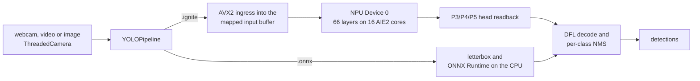

# Ignition

**YOLOv8n object detection on the AMD Ryzen AI Phoenix NPU (XDNA1, AIE2), with ONNX Runtime on the CPU as the fallback.**


Give Ignition a bare-metal `.ignite` container compiled by [ignite-xdna](https://github.com/jdominick05/ignite-xdna) and the whole YOLOv8n network runs on the NPU. Each camera frame takes one NPU dispatch, and boxes are decoded from the detect heads the NPU computes; ONNX Runtime is never called. On a Ryzen 7 8700G, a live 640×480 webcam frame with 5 to 6 objects goes from memory to detections in 7.82–7.89 ms on average over 300-frame runs. An `.onnx` model runs on ONNX Runtime's CPU execution provider instead. On `bus.jpg` the same network takes 8.06 ms per frame from an `.ignite` container on the NPU and 38.82 ms as `.onnx` on the CPU.

## Status

- **NPU path:** `.ignite` containers run on NPU Device 0 `[003d:00:01.1]`. All 66 YOLOv8n layers (63 convolutions and the 3 SPPF max-pools) run on the 16 AIE2 cores.
- **CPU fallback:** `.onnx` models run on ONNX Runtime (`CPUExecutionProvider`).
- **Verified on:** AMD Ryzen 7 8700G with its Phoenix NPU, Windows 11, XRT through `pyxrt`, ignite-xdna `v0.1.0-phoenix-npu` (`397da63`) with the container `build/yolov8n_full.ignite`.
- **Live latency:** 7.82–7.89 ms mean glass-to-glass with 5–6 objects per frame, and 7.58 ms on an empty scene ([Live performance](#live-performance)).
- **Open work:** [TODO.md](TODO.md).

## How a frame runs



Glass-to-glass (G2G) is timed from the moment the loop takes a frame to the moment its detections exist. It covers ingress, NPU dispatch, head readback, decode and NMS. Drawing and display come after it.

### Native XDNA path (`.ignite`)

`YOLOPipeline` recognises an ignite-xdna container by its `.ignite` suffix or its `IGNT` header and hands it to ignite-xdna's `YoloPipeline` on NPU `device_id` (default 0). It drops the ONNX Runtime comparison session that ignite-xdna opens, so no frame can reach ONNX Runtime. The pipeline is a context manager: `close()` releases the NPU hardware context, and a finalizer does so if `close()` is never called.

| Stage | Where it runs | Mean per frame |
|---|---|---:|
| **Ingress:** one fused AVX2 C pass letterboxes, resizes and quantizes the BGR frame straight into the input plane of the mapped XRT buffer object; no int8 tensor is built on the host | ignite-xdna `pipelines/preprocess.py` | 0.15 ms |
| **NPU dispatch:** one run of the graph-engine program on the 16 cores; its instruction stream moves weight packets and activation tiles between host memory and the cores for all 66 layers | NPU Device 0 | 7.21 ms |
| **Head readback:** the P3, P4 and P5 box and class tensors, read from the output buffer | ignite-xdna `runtime/graph_session.py` | 0.24 ms |
| **Decode and NMS:** DFL box decode and per-class NMS on the host | ignite-xdna `YoloDecoder.postprocess` | 0.28 ms (0.05 ms on an empty scene) |

The stage means come from the 2026-09-14 re-check run with 5.43 objects per frame and 7.89 ms G2G. Activations return to host memory between layers. A copy of this container with every weight op switched off still took 5.37 ms against the real container's 7.39 ms (300 dispatches each; ignite-xdna branch `worktree-model-zoo`, `results/model_zoo/dispatch_floor_yolov8n_full.json`). Most of the dispatch is therefore data movement rather than compute.

A container without detect heads, such as the legacy `build/yolov8n.ignite`, still loads. Ignition warns that its frames will have no detections.

### ONNX Runtime CPU fallback (`.onnx`)

Any other model file loads into ONNX Runtime with the CPU execution provider. The frame is letterboxed with OpenCV and numpy, the network runs on ONNX Runtime, and boxes go through the same decode and NMS. For `yolov8n_cut_xint8.onnx` on `bus.jpg` that is 1.96 ms of preprocessing, 34.70 ms of ONNX Runtime and 2.15 ms of decode and NMS: 38.82 ms mean G2G over 300 frames. It finds the same 5 objects as the NPU path, and the two paths' boxes match with a class-matched mIoU of 0.977.

`live_ignition.py` opens `.onnx` models on the CPU backend. `ignition.compile` and `ignition detect` default to `backend="xdna1"`, which for an `.onnx` YOLO model also runs an unused ignite-xdna layer-backend call on every frame ([TODO.md](TODO.md#4-honest-backends)). Pass `--backend cpu` for the plain CPU path.

### Camera capture: `ThreadedCamera`

- **Capture thread:** a thread owns `cv2.VideoCapture` and absorbs the 33–66 ms each sensor read blocks for. It publishes every frame with a sequence number and an arrival time. The inference loop takes the newest frame without waiting; with `--fresh` it waits for the next new one.
- **Backend negotiation:** DirectShow is tried first, then Media Foundation, then OpenCV's default backend. Each open runs in a helper thread and is abandoned after `--open-timeout` (8 s by default), because DirectShow can block forever on an IR sensor. A backend counts as open only once it has delivered a non-empty first frame.
- **Empty frames:** empty or failed reads are counted and skipped, never passed to the pipeline.
- **Media Foundation start-up:** `OPENCV_VIDEOIO_MSMF_ENABLE_HW_TRANSFORMS=0` is set before OpenCV loads; without it, a Media Foundation open can take about 90 s.
- **Shutdown:** q, ESC, closing the window, Ctrl+C and Ctrl+Break all release the camera, the window and the NPU context, then exit 0.

## Live performance

YOLOv8n on NPU Device 0 of a Ryzen 7 8700G:
- **Setup:** Windows 11, the `mlir-aie-iron` conda environment, ignite-xdna `397da63` with `build/yolov8n_full.ignite`, webcam 0 through DirectShow at 640×480, 10 warm-up frames per run.
- **Records:** Ignition does not track benchmark logs, so the Record column names the commit whose message carries the run. Rows marked *re-check* were measured on 2026-09-14 for this README, and the commit that updated the README records their logs.

| `live_ignition.py` run | Scene | Timed frames | Objects / frame | G2G mean | G2G P99 | Record |
|---|---|---:|---:|---:|---:|---|
| `--headless --frames 300` | webcam, dark room | 300 | 0 | 7.58 ms | 7.91 ms | `ee66fbd` |
| `--headless --frames 300` | webcam, lit room | 300 | 5.44 | 7.82 ms | 8.18 ms | `8ffa482` |
| `--headless --frames 300` | webcam, lit room | 300 | 5.27 | 7.87 ms | 8.58 ms | `8ffa482` |
| `--headless --frames 300` | webcam, lit room | 300 | 5.43 | 7.89 ms | 8.39 ms | re-check |
| `--headless --frames 500` | webcam, lit room | 500 | 5.90 | 8.02 ms | 8.55 ms | `8ffa482` |
| `--headless --frames 300 --fresh` | webcam, every frame new | 300 | 5.00 | 8.03 ms | 8.51 ms | `8ffa482` |
| window, closed with q | webcam, lit room | 714 | 5.74 | 7.98 ms | 8.52 ms | `8ffa482` |
| `--source` a 640×480 crop of `bus.jpg`, `--headless --frames 500` | still image | 500 | 4.00 | 7.86 ms | 8.39 ms | `ee66fbd` |
| `--source examples/assets/bus.jpg --headless --frames 300` | still image, 810×1080 | 300 | 5.00 | 8.06 ms | 8.67 ms | re-check |
| the same with `--model …/yolov8n_cut_xint8.onnx` (CPU) | still image, 810×1080 | 300 | 5.00 | 38.82 ms | 46.49 ms | re-check |

- **Stage times:** across these runs NPU dispatch took 7.14–7.26 ms and head readback 0.22–0.28 ms. Decode and NMS took 0.25–0.33 ms with objects in view and 0.05 ms on the empty scene.
- **Throughput:** the headless loop re-runs the newest frame and reported 122 to 129 FPS. `ignition detect --stream --benchmark --frames 100` on `bus.jpg` sustained 123.47 FPS (median 7.98 ms). Live throughput is set by the camera: the webcam delivers 15 frames per second through DirectShow, so `--fresh` runs at 15 FPS, with 8.10 ms from camera arrival to detections ([TODO.md](TODO.md#1-camera-rate-30-fps-from-the-webcam)).
- **Memory:** resident memory stayed flat: −1.12 MB over 500 lit webcam frames, −1.15 MB over 500 dark ones and +0.02 MB over 500 frames of a still image.
- **Every run:** exit 0, no ONNX Runtime `run()` call on the `.ignite` path, and `xrt-smi` reporting no hardware contexts running afterwards.

### Earlier measurements

- **Vitis AI EP.** The 2026-09-12 comparison (`12e162a`) used a different harness on the same 640×640 letterboxed `bus.jpg`. AMD's ONNX Runtime Vitis AI execution provider measured 10.36 ms mean end-to-end over 500 iterations, 6.61 ms of it in the backbone. Ignition's figures in that comparison predate the `.ignite` path and measured the ONNX Runtime path.
- **Layer backend.** `ignition.compile("model.onnx", backend="xdna1")` returns a `Model` on ignite-xdna's partitioner and MemTile multi-pass scheduler, using the `im2col_4d_16core.xclbin` bundled in `src/ignition/assets`. On 2026-09-12 it ran synthetic 1- to 4-layer Conv2D subgraphs, handing activations between layers in MemTile SRAM with no host copies. Each run took 163.75–168.37 µs, or 5,939–6,107 inferences per second ([log](https://github.com/jdominick05/ignite-xdna/blob/main/results/aie/hardware_multi_layer_scheduler.log)). These are subgraph figures, not whole-network latency.

## Quickstart

### Requirements

- Windows 11 on an AMD Ryzen AI processor with a Phoenix (XDNA1) NPU and AMD's NPU driver. Verified on a Ryzen 7 8700G.
- A Python environment where `pyxrt` imports. Verified with Python 3.13 in the `mlir-aie-iron` conda environment.
- ignite-xdna checked out next to Ignition, with `build/yolov8n_full.ignite` compiled there by `ignite-compile --engine graph --output build/yolov8n_full.ignite`. The graph engine needs the mlir-aie IRON toolchain; see ignite-xdna's README.
- Before timing anything, check that `xrt-smi examine -r aie-partitions` reports `No hardware contexts running`.

### Install

```bash
git clone https://github.com/jdominick05/ignite-xdna.git
git clone https://github.com/jdominick05/Ignition.git
pip install -e ignite-xdna
pip install -e Ignition
cd Ignition
```

### Live camera: `live_ignition.py`

```bash
python live_ignition.py                                   # webcam 0 in a window: boxes, labels, scores, G2G HUD; q or ESC quits
python live_ignition.py --headless --frames 300           # no window: G2G mean/P50/P95/P99, stage means, RSS drift
python live_ignition.py --headless --frames 300 --fresh   # wait for each new camera frame (camera-paced)
python live_ignition.py --model ../ignite-xdna/build/yolov8n_full.ignite --source 0
python live_ignition.py --model ../ignite-xdna/build/yolov8n_full.ignite --source examples/assets/bus.jpg --headless --frames 300
python live_ignition.py --model ../ignite-xdna/models/yolov8n_cut_xint8.onnx --source examples/assets/bus.jpg --headless --frames 300
```

| Flag | Meaning |
|---|---|
| `--model` | An `.ignite` container (NPU) or `.onnx` model (ONNX Runtime CPU). The default is `../ignite-xdna/build/yolov8n_full.ignite`, falling back to `build/yolov8n.ignite`, which has no detect heads. |
| `--source` | Webcam index (`0`, `1`, …), video file or image (default `0`). |
| `--headless` | No window; prints a progress line every 100 frames. |
| `--frames N` | Stop after N timed frames and print the summary (default 0: run until stopped). |
| `--warmup N` | Untimed frames before the timed ones (default 10). |
| `--fresh` | Wait for a new camera frame before each inference instead of reusing the newest one. |
| `--conf`, `--iou` | Confidence and NMS IoU thresholds (defaults 0.25 and 0.45). |
| `--open-timeout` | Seconds allowed for each camera backend to open (default 8). |

Boxes come from the NPU's detect heads whenever the container carries them; nothing needs switching on. The re-check's `--headless --frames 300` run on the webcam ended with:

```text
[summary] stop: frame limit | 310 frames processed (10 warm-up, 300 timed) | 37 distinct source frames | camera 0 via DSHOW 640x480
[summary] G2G mean 7.887 ms | P50 7.846 | P95 8.189 | P99 8.389 | max 8.654 | over the last 300 timed frames; cold first frame 11.21 ms
[summary] stage means (ms): preprocess 0.150 | NPU forward 7.451 (dispatch 7.212, readback 0.239) | decode+NMS 0.278
[summary] boxes from NPU heads on 300/300 timed frames | 5.43 detections per frame
[summary] RSS 211.1 MB at the first timed frame, 211.0 MB at the end (-0.18 MB over 300 frames)
```

### Python API

```python
import ignition

with ignition.compile("../ignite-xdna/build/yolov8n_full.ignite", pipeline="yolo") as pipe:
    result = pipe.predict("examples/assets/bus.jpg")
    print(result.summary())  # detections plus preprocess, NPU dispatch, head readback and NMS times
```

`pipe.predict` takes a path, a PIL image or a BGR numpy array. `pipe.stream(frames)` yields one result per frame of an iterable.

### `ignition` CLI

```bash
ignition devices                                                                                     # probe NPU Device 0 through pyxrt
ignition detect ../ignite-xdna/build/yolov8n_full.ignite --input examples/assets/bus.jpg --output detections.jpg
ignition detect ../ignite-xdna/build/yolov8n_full.ignite --input examples/assets/bus.jpg --stream --benchmark --frames 100
```

- **`--stream` on an `.ignite` container:** runs one synchronous NPU dispatch per frame. The 3-stage asynchronous runner is used only for `.onnx` models.
- **Other commands:** `ignition run` and `ignition benchmark` drive the layer backend on ONNX models; see `ignition --help`.

## Repository layout

```
Ignition/
├── live_ignition.py           # live webcam / video / image detection with G2G percentiles and RSS drift
├── src/ignition/
│   ├── __init__.py            # compile(), devices() and the public exports
│   ├── pipelines/
│   │   ├── yolo.py            # YOLOPipeline: .ignite on the NPU via ignite-xdna, .onnx on ONNX Runtime; decode, NMS, drawing
│   │   └── streaming.py       # 3-stage asynchronous runner for .onnx models
│   ├── backends/
│   │   ├── xdna1.py           # layer backend: ignite-xdna InferenceSession on the bundled xclbin
│   │   ├── cpu.py             # ONNX Runtime CPU backend
│   │   └── base.py            # backend interface and BenchmarkReport
│   ├── model.py               # Model: predict and benchmark on a backend
│   ├── devices.py             # NPU discovery through pyxrt
│   ├── assets/                # im2col_4d_16core.xclbin and layer transaction binaries
│   └── cli/main.py            # ignition devices | run | benchmark | detect
├── examples/
│   ├── yolo_vision_demo.py    # single-image detection demo (--model, --image, --backend)
│   ├── quickstart.py          # layer-backend Model example
│   └── assets/bus.jpg
├── TODO.md                    # completed milestones and open work
├── pyproject.toml             # package ignition-ai 0.2.0, console script `ignition`
└── LICENSE                    # GNU Affero General Public License v3.0 or later
```

## License

Ignition is licensed under the [GNU Affero General Public License v3.0 or later](LICENSE).
