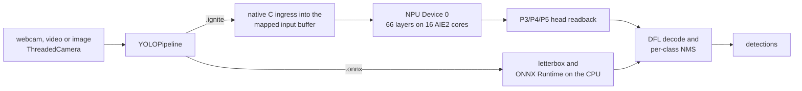

``` 
 (                                  
 )\ )                )              
(()/((  (      (  ( /((             
 /(_))\))( (   )\ )\())\  (   (     
(_))((_))\ )\ |(_|_))((_) )\  )\ )  
|_ _|(()(_)(_/((_) |_ (_)((_)_(_/(  
 | |/ _` | ' \)) |  _|| / _ \ ' \)) 
|___\__, |_||_||_|\__||_\___/_||_|  
    |___/                               
```

**Real-time object detection on the AMD Ryzen™ AI NPU: faster end to end than AMD's own runtime, from a fraction of the install size.**


Ignition runs YOLOv8n object detection on the NPU built into AMD Ryzen AI processors. All 66 layers of the network run on the NPU, not your CPU. Point it at a webcam and each captured frame becomes labelled boxes in about 8 milliseconds.

- **About 25% lower end-to-end latency than AMD's stack.** The same model and image took 7.75–7.78 ms per frame through Ignition and 10.33–10.37 ms through AMD's ONNX Runtime Vitis AI execution provider, measured back to back on the same machine.
- **Inference about 4× faster than on the CPU.** The network itself took 7.4 ms on the NPU and 28.4 ms on ONNX Runtime's CPU path, for the same model and image. End to end, a frame took 7.75–7.78 ms against 32.1 ms.
- **Lighter to install and run.** Resident memory was 192.5–192.7 MB against AMD's 305.4–306.3 MB (37% less), and the runtime install is about 318 MB against 4.7 GB (93% smaller).
- **Same answers.** On the reference image both stacks find the same five objects, and their boxes overlap 97% on average (mean IoU 0.968).
- **A working app included.** `python live_ignition.py` opens your webcam with boxes, labels, confidence scores and a live latency readout.

## Ignition vs AMD's Ryzen AI stack

The same model (`yolov8n_cut_xint8.onnx`, AMD Quark XINT8) ran on the same image (`examples/assets/bus.jpg`) on a Ryzen 7 8700G. Each run had 50 warm-up and 500 timed frames. Runs alternated AMD, Ignition, AMD, Ignition, with the NPU checked idle before each, and both runs are shown in every cell. Ignition ran on ignite-xdna `5688f6d`.

| | **Ignition** | **AMD Ryzen AI Software 1.7.1**<br/>ONNX Runtime + Vitis AI EP |
|---|---|---|
| **End-to-end latency, mean** | **7.78 / 7.75 ms** | 10.37 / 10.33 ms |
| End-to-end latency, 95th percentile | **8.02 / 7.96 ms** | 10.93 / 10.98 ms |
| ↳ image preparation (letterbox, quantize) | **0.31 / 0.31 ms**, native code into the NPU's buffer | 1.72 / 1.73 ms |
| ↳ NPU | 7.43 / 7.41 ms | **6.71 / 6.70 ms** |
| ↳ box decode and NMS | **0.033 / 0.031 ms**, native code | 1.94 / 1.90 ms |
| **Process memory (RSS)** | **192.7 / 192.5 MB** | 305.4 / 306.3 MB |
| **Runtime install on disk** | **≈318 MB** | ≈4,704 MB |
| Detections on `bus.jpg` | 4 people, 1 bus | the same 5 objects (box IoU 0.93–0.99) |
| Where the network runs | all 66 layers on the NPU | 922 of 929 graph nodes on the NPU; 7 quantize/dequantize nodes on the CPU |
| Models it accelerates | YOLOv8n today; other `.onnx` models run on the CPU | any ONNX model its compiler accepts |
| Before the first run | a compiled `.ignite` container (a one-time build with ignite-xdna) | none: the model compiles on its first session and is cached |

**What the comparison does and does not show:**
- **Where Ignition's lead comes from.** It is entirely in host-side code. AMD's runtime executes the network and leaves image preparation and box decoding to your application, so the AMD column uses Ignition's reference numpy versions of those steps. Ignition ships them as native code. Hand-written native pre- and post-processing on AMD's stack would narrow the gap.
- **Where AMD is ahead.** AMD's NPU stage itself is about 0.7 ms faster than Ignition's. AMD's stack also runs a much wider range of models, and its current release targets newer NPUs.
- **What the disk figures count.** AMD's covers the Ryzen AI 1.7.1 install (4,072 MB), its ONNX Runtime with the Vitis AI EP (615 MB), `voe` (3 MB) and the compile cache (14 MB). Ignition's covers the XRT SDK with `pyxrt` (262 MB), ONNX Runtime for the CPU fallback (44 MB), ignite-xdna (3 MB), the `.ignite` container (8 MB) and Ignition itself (66 KB). Neither counts Python, numpy, OpenCV or the NPU driver. Building a container needs the mlir-aie toolchain, which is not counted.
- **Why the AMD column uses 1.7.1.** In this project's testing, Ryzen AI Software 1.8.0 installed without the Phoenix/Hawk Point xclbin that its own documentation calls for, and rejected the driver's XDNA1 xclbins, so NPU inference on these chips stays on 1.7.1. That looks like a packaging bug, reported upstream as [amd/RyzenAI-SW#400](https://github.com/amd/RyzenAI-SW/issues/400) ([ignite-xdna decision record](https://github.com/jdominick05/ignite-xdna/blob/main/docs/DECISIONS.md)).

## Compatibility

| | Status | Details |
|---|---|---|
| **AMD Phoenix NPU (XDNA1)** | ✅ Verified | Ryzen 7 8700G, NPU `[003d:00:01.1]` |
| **AMD Hawk Point NPU (XDNA1)** | ⚠️ Untested | Same XDNA1 4×4 NPU generation as Phoenix; the `.ignite` path has not been run on one |
| **Strix-class NPUs (AIE2P)** | ❌ Not supported | Different NPU architecture; `.ignite` containers target XDNA1 |
| **Windows 11** | ✅ Verified | Windows 11 Pro, build 26200.9445 |
| **Linux** | ❌ Not supported | Ignition uses the Windows XRT stack |
| **NPU driver and XRT** | ✅ Verified | NPU driver 32.0.20101.3760, firmware 1.5.5.391, XRT 2.21.0 |
| **Python** | ✅ 3.10–3.13 (CPU), 3.13 (NPU) | The CPU path installs and runs on 3.10, 3.11, 3.12 and 3.13. The NPU path needs the Python the XRT SDK's `pyxrt` was built for, 3.13 with XRT 2.21.0; on 3.12 it stops at `DLL load failed while importing pyxrt` |
| **YOLOv8n detection on the NPU** | ✅ Verified | 640×640 input, AMD Quark XINT8, compiled to `build/yolov8n_full.ignite` by ignite-xdna |
| **Other models on the NPU** | ⚠️ In development | YOLOv8s and SESR M7 (super-resolution) compile and run on the NPU in an ignite-xdna development branch; not released |
| **Other ONNX models** | ✅ CPU only | ONNX Runtime's CPU execution provider |
| **Webcams** | ✅ Verified | USB webcams through DirectShow, then Media Foundation; tested at 640×480 |
| **Video files and images** | ✅ Verified | Anything OpenCV opens, letterboxed to 640×640; tested with 640×480 and 810×1080 frames |
| **Interfaces** | ✅ Verified | Webcam app `live_ignition.py`, Python API, `ignition` command line |
| **AMD Ryzen AI Software** | Not needed at runtime | The model input is AMD Quark's XINT8 ONNX; turning it into a container needs ignite-xdna and the mlir-aie toolchain |

## Quick start

### What you need

- **Hardware:** a Windows 11 PC with an AMD Phoenix NPU and AMD's NPU driver.
- **Python:** the version the XRT SDK's `pyxrt` was built for, 3.13 with XRT 2.21.0; `pyxrt` does not load on others. The CPU path on its own runs on 3.10 to 3.13.
- **Runtime and model:** [ignite-xdna](https://github.com/jdominick05/ignite-xdna) checked out next to Ignition, with the YOLOv8n container built there by `ignite-compile --engine graph --output build/yolov8n_full.ignite` (needs the mlir-aie IRON toolchain; see ignite-xdna's README).

### Install

**From a release.** Download the wheels from the [v0.3.1 release](https://github.com/jdominick05/Ignition/releases/tag/v0.3.1) into one folder and run pip in that folder; GitLab's release carries the same files. For the NPU path:

```bash
pip install ./ignite_xdna-0.2.0-py3-none-any.whl "./ignition_ai-0.3.1-py3-none-any.whl[npu]"
```

For `.onnx` models on the CPU only:

```bash
pip install ./ignition_ai-0.3.1-py3-none-any.whl
```

The wheels carry the Python API and the `ignition` command. The webcam app `live_ignition.py` lives in the repository, not the wheel, and the container is still built in an ignite-xdna checkout. v0.3.1 predates the backend, camera and native-decode changes listed in [TODO.md](TODO.md)'s completed work.

**From source**, which the steps below use:

```bash
git clone https://github.com/jdominick05/ignite-xdna.git
git clone https://github.com/jdominick05/Ignition.git
pip install -e ignite-xdna
pip install -e Ignition
cd Ignition
```

### 1. See it work

```bash
python live_ignition.py
```

A window opens on webcam 0 with boxes, labels, scores and the per-frame latency. Press q or ESC to quit.

### 2. Measure it on your machine

```bash
python live_ignition.py --headless --frames 300
```

This command's output on the test machine (lit room, webcam 0):

```text
[summary] stop: frame limit | 310 frames processed (10 warm-up, 300 timed) | 70 distinct source frames | camera 0 via DSHOW 640x480
[summary] camera: 71 frames in 2.4 s = 29.78 fps read, 0 repeated the previous frame, 29.78 distinct fps
[summary] G2G mean 7.485 ms | P50 7.483 | P95 7.637 | P99 7.794 | max 7.942 | over the last 300 timed frames; cold first frame 11.35 ms
[summary] stage means (ms): preprocess 0.133 | NPU forward 7.317 (dispatch 7.122, readback 0.195) | decode+NMS 0.030
[summary] boxes from NPU heads on 300/300 timed frames | 4.62 detections per frame
[summary] RSS 211.7 MB at the first timed frame, 211.7 MB at the end (+0.00 MB over 300 frames)
```

More ways to run it:

```bash
python live_ignition.py --headless --frames 300 --fresh   # wait for each new camera frame (camera-paced)
python live_ignition.py --headless --frames 300 --fresh --exposure-priority off   # hold 30 fps in dim light: darker image, fewer detections
python live_ignition.py --model ../ignite-xdna/build/yolov8n_full.ignite --source examples/assets/bus.jpg --headless --frames 300
python live_ignition.py --model ../ignite-xdna/models/yolov8n_cut_xint8.onnx --source examples/assets/bus.jpg --headless --frames 300   # CPU path
```

| Flag | Meaning |
|---|---|
| `--model` | An `.ignite` container (NPU) or `.onnx` model (CPU). Defaults to `../ignite-xdna/build/yolov8n_full.ignite`. |
| `--source` | Webcam index (`0`, `1`, …), video file or image (default `0`). |
| `--headless` | No window; prints a progress line every 100 frames. |
| `--frames N` | Stop after N timed frames and print the summary (default 0: run until stopped). |
| `--warmup N` | Untimed frames before the timed ones (default 10). |
| `--fresh` | Wait for a new camera frame before each inference instead of reusing the newest one. |
| `--conf`, `--iou` | Confidence and NMS IoU thresholds (defaults 0.25 and 0.45). |
| `--open-timeout` | Seconds allowed for each camera backend to open (default 8). |
| `--camera-backend` | `auto` (DirectShow, then Media Foundation, then OpenCV's default; the default), `dshow`, `msmf` or `any`. |
| `--exposure-priority` | `keep` (default) leaves the webcam's setting. `off` holds the frame rate in dim light at the cost of a darker image; `on` lets auto exposure lower it. DirectShow only. The camera keeps this setting across programs, so the previous value is put back on exit; a killed process leaves it changed. |

### 3. Use it from Python

```python
import ignition

with ignition.compile("../ignite-xdna/build/yolov8n_full.ignite", pipeline="yolo") as pipe:
    result = pipe.predict("examples/assets/bus.jpg")
    print(result.summary())  # detections plus preprocess, NPU dispatch, head readback and NMS times
```

- **`pipe.predict`** takes a path, a PIL image or a BGR numpy array.
- **`pipe.stream(frames)`** yields one result per frame from an iterable.

### 4. Use it from the command line

```bash
ignition devices
ignition detect ../ignite-xdna/build/yolov8n_full.ignite --input examples/assets/bus.jpg --output detections.jpg
ignition detect ../ignite-xdna/build/yolov8n_full.ignite --input examples/assets/bus.jpg --stream --benchmark --frames 100
```

On the test machine, the 100-frame benchmark sustained 128.78 frames per second with a median of 7.70 ms.

## Performance

All figures come from YOLOv8n on NPU Device 0 of a Ryzen 7 8700G:
- **Setup:** Windows 11, `build/yolov8n_full.ignite`, webcam 0 through DirectShow at 640×480, 10 warm-up frames per run unless the command sets `--warmup`. Rows with a commit ran ignite-xdna `v0.1.0-phoenix-npu`, which decodes boxes in numpy and runs NMS through OpenCV; *re-check* rows ran ignite-xdna `5688f6d`, which does both in one native C pass.
- **Records:** each row names the commit whose message records the run. *Re-check* rows were measured on 2026-09-14 and are recorded in the commit that added them to this README.

| `live_ignition.py` run | Scene | Timed frames | Objects / frame | Mean | 99th pct | Record |
|---|---|---:|---:|---:|---:|---|
| `--headless --frames 300` | webcam, dark room | 300 | 0 | 7.58 ms | 7.91 ms | `ee66fbd` |
| `--headless --frames 300` | webcam, lit room | 300 | 5.44 | 7.82 ms | 8.18 ms | `8ffa482` |
| `--headless --frames 300` | webcam, lit room | 300 | 5.27 | 7.87 ms | 8.58 ms | `8ffa482` |
| `--headless --frames 300` | webcam, lit room | 300 | 5.43 | 7.89 ms | 8.39 ms | `0f374e5` |
| `--headless --frames 300` | webcam, lit room | 300 | 4.62 | 7.49 ms | 7.79 ms | re-check |
| `--headless --frames 500` | webcam, lit room | 500 | 5.90 | 8.02 ms | 8.55 ms | `8ffa482` |
| `--headless --frames 300 --fresh` | webcam, every frame new | 300 | 5.00 | 8.03 ms | 8.51 ms | `8ffa482` |
| window, closed with q | webcam, lit room | 714 | 5.74 | 7.98 ms | 8.52 ms | `8ffa482` |
| `--source` a 640×480 crop of `bus.jpg`, `--headless --frames 500` | still image | 500 | 4.00 | 7.86 ms | 8.39 ms | `ee66fbd` |
| `--source examples/assets/bus.jpg --headless --frames 300` | still image, 810×1080 | 300 | 5.00 | 8.06 ms | 8.67 ms | `0f374e5` |
| `--source examples/assets/bus.jpg --headless --warmup 50 --frames 500` | still image, 810×1080 | 500 | 5.00 | 7.78 ms | 8.28 ms | re-check |
| `--source examples/assets/bus.jpg --headless --warmup 50 --frames 500` | still image, 810×1080 | 500 | 5.00 | 7.75 ms | 8.10 ms | re-check |

- **Frame rate:** Ignition's processing loop ran at 122 to 129 frames per second with the numpy decode and 133 to 134 with the native one, so the camera sets the live rate, and the camera's auto exposure sets that. The test webcam, a Logitech C920, delivered 30 distinct frames per second in a bright room and 15 in a dim one, whatever rate or pixel format was requested. In the dim room `--exposure-priority off` held 30, with 2.43 detections per frame against 5.55–6.06 at 15. Media Foundation reads at 30 fps partly by repeating frames, so the `[summary] camera:` line counts the distinct ones. With `--fresh`, each new frame became detections 8.10 ms after it arrived.
- **Decode and NMS:** in native code they took 0.030 ms with 4.62 objects per frame on the webcam and 0.031–0.033 ms with 5 on `bus.jpg`. The numpy and OpenCV version behind the rows with a commit took 0.25–0.33 ms with 5–6 objects in view and 0.05 ms on an empty scene.
- **Long runs:** resident memory did not grow: −1.12 MB over 500 webcam frames in a lit room, −1.15 MB over 500 in a dark one, +0.02 MB over 500 frames of a still image.
- **Clean exit:** every run exited cleanly and released the NPU; afterwards `xrt-smi` reported no hardware contexts running.

## How a frame runs



Latency is measured glass to glass: from the moment the loop takes a frame to the moment its detections exist. Drawing and display come after it.

| Stage (native path) | What happens | Mean per frame |
|---|---|---:|
| Ingress | One native C pass (OpenMP) letterboxes, resizes and quantizes the frame straight into the NPU's mapped input buffer | 0.133 ms |
| NPU dispatch | One run of ignite-xdna's graph-engine program computes all 66 layers on the 16 AIE2 cores | 7.122 ms |
| Head readback | The P3, P4 and P5 box and class tensors are read from the output buffer | 0.195 ms |
| Decode and NMS | One native C pass decodes DFL boxes for the anchors that clear the confidence threshold and runs per-class non-maximum suppression on the host | 0.030 ms |

These stage times come from the webcam re-check above: 640×480 frames with 4.62 objects per frame. A larger source costs more at ingress; the 810×1080 `bus.jpg` in the AMD comparison took 0.31 ms.
- **What the NPU time is spent on:** activations move between host memory and the NPU between layers, so most of the dispatch is data movement. A copy of the container with every weight operation switched off still took 5.37 ms of a 7.39 ms dispatch (ignite-xdna `results/model_zoo/dispatch_floor_yolov8n_full.json`).
- **The CPU fallback:** an `.onnx` model runs the same steps on ONNX Runtime's CPU execution provider instead.
- **The camera:** a capture thread (`ThreadedCamera`) owns the webcam so sensor I/O never stalls inference. It tries DirectShow, then Media Foundation, abandons a backend that does not open within `--open-timeout`, and skips empty frames. It counts the frames it reads and the ones that repeat the previous frame. q, ESC, closing the window, Ctrl+C and Ctrl+Break all release the camera and the NPU.

## Limitations

- **One NPU model today.** YOLOv8n is the only model with a released `.ignite` container. Other ONNX models run, but on the CPU.
- **A build step.** The `.ignite` container is built from AMD Quark's quantized model with ignite-xdna and the mlir-aie toolchain; it is not a pip install.
- **Narrow hardware support.** Only Phoenix has been verified. Hawk Point is untested, and Strix-class NPUs and Linux are not supported.
- **Dim light halves the webcam's frame rate.** The test webcam's auto exposure drops to 15 fps in a dim room; `--exposure-priority off` holds 30 fps with a darker image and fewer detections.
Open work is tracked in [TODO.md](TODO.md).

## Project layout

```
Ignition/
├── live_ignition.py           # webcam / video / image app with latency percentiles
├── src/ignition/
│   ├── __init__.py            # compile(), devices()
│   ├── pipelines/yolo.py      # YOLOPipeline: .ignite on the NPU via ignite-xdna, .onnx on ONNX Runtime
│   ├── pipelines/streaming.py # 3-stage asynchronous runner for .onnx models
│   ├── backends/              # xdna1 layer backend, ONNX Runtime CPU backend
│   ├── model.py, devices.py   # Model API, NPU discovery
│   └── cli/main.py            # ignition devices | run | benchmark | detect
├── examples/                  # yolo_vision_demo.py, quickstart.py, assets/bus.jpg
├── TODO.md                    # completed milestones and open work
└── pyproject.toml             # package ignition-ai, console script `ignition`
```

## License

Ignition is licensed under the [GNU Affero General Public License v3.0 or later](LICENSE).
