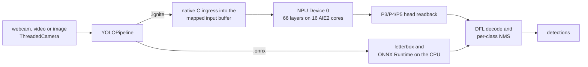

# Ignition performance

Every figure on this page was measured on a Ryzen 7 8700G (Phoenix NPU) under Windows 11. The README's badges read their numbers from this page.

## Ignition vs AMD's Ryzen AI stack

**Against AMD's stack: 8.50 / 8.53 ms and 34.12 mAP@50-95, against 10.66 / 10.42 ms and 26.68.**

The same model (`yolov8n_cut_xint8.onnx`, AMD Quark XINT8) ran on the same image (`examples/assets/bus.jpg`) on a Ryzen 7 8700G. Ignition ran it as the container the README builds, compiled with `--silu-sigmoid`. Each run had 50 warm-up and 500 timed frames. Runs alternated AMD's stack, Ignition in its default `balanced` power mode, Ignition with `--power-mode performance` and a control container compiled without `--silu-sigmoid`, twice, with the NPU checked idle before each group, and both runs are shown in every cell. Both containers first matched their reference on every layer (66/66). Measured on 2026-09-17 (UTC) with ignite-xdna at `1879614`, released as 0.3.1, and Ignition at `e27ef79`; the record is ignite-xdna's `results/aie/release_033/latency_release033_phoenix_20260917T1538Z.log`.

| | **Ignition** (default power mode) | **AMD Ryzen AI Software 1.7.1** ONNX Runtime + Vitis AI EP | Ignition, `--power-mode performance` |
|---|---|---|---|
| **End-to-end latency, mean** | **8.50 / 8.53 ms** | 10.66 / 10.42 ms | 8.08 / 8.14 ms |
| End-to-end latency, 95th percentile | **8.85 / 8.88 ms** | 11.38 / 10.97 ms | 8.17 / 8.24 ms |
| ↳ image preparation (letterbox, quantize) | **0.61 / 0.64 ms**, native code into the NPU's buffer | 1.84 / 1.80 ms | 0.41 / 0.40 ms |
| ↳ NPU (dispatch and head readback) | 7.76 / 7.75 ms | **6.70 / 6.58 ms** | 7.55 / 7.61 ms |
| ↳ box decode and NMS | **0.132 / 0.136 ms**, native code | 2.12 / 2.05 ms | 0.121 / 0.120 ms |
| **Detection accuracy, COCO val2017** (mAP@50-95, all 5,000 images) | **34.12** | 26.68 | the same container |
| **Process memory (RSS)** | **191.5 / 191.0 MB** | 304.4 / 304.7 MB | 191.7 / 191.5 MB |
| **Runtime install on disk** | **≈318 MB** | ≈4,704 MB | the same install |
| Detections on `bus.jpg` | 5 objects | 5 objects: 4 people, 1 bus | 5 objects |
| Where the network runs | all 66 layers on the NPU | 922 of 929 graph nodes on the NPU; 7 quantize/dequantize nodes on the CPU | all 66 layers on the NPU |
| Models it accelerates | YOLOv8n, YOLOv8s, SESR M7, YOLOv8n-pose and YOLO11n (attention matrix multiplies and softmax on the CPU); other `.onnx` models run on the CPU | any ONNX model its compiler accepts | |
| Before the first run | a compiled `.ignite` container (a one-time build with ignite-xdna) | none: the model compiles on its first session and is cached | |

**What the comparison does and does not show:**
- **What `--silu-sigmoid` buys.** AMD's XINT8 model replaces every SiLU activation's sigmoid with a HardSigmoid, a straight-line approximation. With the flag the NPU computes a closer four-line integer sigmoid instead. On all 5,000 COCO val2017 images, every run through the same letterbox, the container scored 34.12 mAP@50-95 against 26.68 for AMD's stack and 27.10 for a container without the flag (ignite-xdna's `results/aie/silu_sigmoid_vs_amd/accuracy/summary.log`). In this sitting the control without the flag ran 8.26 / 8.29 ms, so the flag costs 0.24 / 0.25 ms per frame, all of it NPU dispatch.
- **Where the latency lead comes from.** It is entirely in host-side code. AMD's runtime executes the network and leaves image preparation and box decoding to your application, so the AMD column uses Ignition's reference numpy versions of those steps. Ignition ships them as native code. Hand-written native pre- and post-processing on AMD's stack would narrow the gap.
- **What the default power mode costs.** `balanced` lets Ignition's host threads sleep between frames. It is 0.41 ms slower than `performance` on the means, and almost none of that (0.03 ms) is NPU dispatch. Preparation takes 0.22 ms longer, and the head readback after the NPU's wait 0.28 against 0.13 ms. In exchange it spends about a third of `performance`'s energy per frame ([energy per frame](#energy-per-frame-against-amds-stack)). Before power modes existed Ignition always spun: that sitting, from an `install.ps1` installation of ignite-xdna `5688f6d`, read 7.78 / 7.75 ms against AMD's 10.37 / 10.33 ms (recorded in `ffdefad`).
- **Where AMD is ahead.** AMD's NPU stage itself is about 1.1 ms faster than Ignition's in the default mode and 0.9 ms in `performance`; about 0.26 ms of that is the flag. The node placement comes from the `ffdefad` sitting. AMD's stack also runs a much wider range of models, and its current release targets newer NPUs.
- **Earlier sittings.** On 2026-09-16, on a container without the flag and ignite-xdna 0.3.0, Ignition read 8.42 / 8.39 ms against AMD's 10.39 / 10.34 ms (ignite-xdna's `results/aie/latency_balanced_default_phoenix_20260916T1745Z.log`). Since then ignite-xdna reads the detection heads in place: readback fell from about 0.60 to 0.28 ms, and decode and NMS rose from 0.04 to 0.13 ms.
- **What the disk figures count.** AMD's covers the Ryzen AI 1.7.1 install (4,072 MB), its ONNX Runtime with the Vitis AI EP (615 MB), `voe` (3 MB) and the compile cache (14 MB). Ignition's covers the XRT SDK with `pyxrt` (262 MB), ONNX Runtime for the CPU fallback (44 MB), ignite-xdna (3 MB), the `.ignite` container (8 MB) and Ignition itself (66 KB). Neither counts Python, numpy, OpenCV or the NPU driver. Building a container needs the mlir-aie toolchain, which is not counted.
- **Why the AMD column uses 1.7.1.** In this project's testing, Ryzen AI Software 1.8.0 installed without the Phoenix/Hawk Point xclbin that its own documentation calls for, and rejected the driver's XDNA1 xclbins, so NPU inference on these chips stays on 1.7.1. That looks like a packaging bug, reported upstream as [amd/RyzenAI-SW#400](https://github.com/amd/RyzenAI-SW/issues/400) ([ignite-xdna decision record](https://github.com/jdominick05/ignite-xdna/blob/main/docs/DECISIONS.md)).

## YOLOv8n through live_ignition.py

The table's figures come from YOLOv8n on NPU Device 0 of a Ryzen 7 8700G; [other models](#other-models) follow it:
- **Setup:** Windows 11, `build/yolov8n_full.ignite`, webcam 0 through DirectShow at 640×480, 10 warm-up frames per run unless the command sets `--warmup`. Rows with a commit ran ignite-xdna `v0.1.0-phoenix-npu`, which decodes boxes in numpy and runs NMS through OpenCV; *re-check* rows ran ignite-xdna `5688f6d`, which does both in one native C pass.
- **Records:** each row names the commit whose message records the run. *Re-check* rows were measured on 2026-09-14 and are recorded in the commit that added them to the README.
- **Power mode:** every row predates power modes, so Ignition's host threads spun between frames, which is `--power-mode performance` today. In the default mode expect about 0.4 ms more per frame ([the AMD comparison](#ignition-vs-amds-ryzen-ai-stack)).
- **Container and runtime:** every row ran a container without `--silu-sigmoid`, on ignite-xdna before its channel-block head readback. The README's container adds `--silu-sigmoid`, 0.24 ms more per frame on `bus.jpg` ([the AMD comparison](#ignition-vs-amds-ryzen-ai-stack)).

| `live_ignition.py` run | Scene | Timed frames | Objects / frame | Mean | 99th pct | Record |
|---|---|---:|---:|---:|---:|---|
| `--headless --frames 300` | webcam, dark room | 300 | 0 | 7.58 ms | 7.91 ms | `ee66fbd` |
| `--headless --frames 300` | webcam, lit room | 300 | 5.44 | 7.82 ms | 8.18 ms | `8ffa482` |
| `--headless --frames 300` | webcam, lit room | 300 | 5.27 | 7.87 ms | 8.58 ms | `8ffa482` |
| `--headless --frames 300` | webcam, lit room | 300 | 5.43 | 7.89 ms | 8.39 ms | `0f374e5` |
| `--headless --frames 300` | webcam, lit room | 300 | 4.62 | 7.49 ms | 7.79 ms | re-check |
| `--headless --frames 500` | webcam, lit room | 500 | 5.90 | 8.02 ms | 8.55 ms | `8ffa482` |
| `--headless --frames 300 --fresh` | webcam, every frame new | 300 | 5.00 | 8.03 ms | 8.51 ms | `8ffa482` |
| window, closed with q | webcam, lit room | 714 | 5.74 | 7.98 ms | 8.52 ms | `8ffa482` |
| `--source` a 640×480 crop of `bus.jpg`, `--headless --frames 500` | still image | 500 | 4.00 | 7.86 ms | 8.39 ms | `ee66fbd` |
| `--source examples/assets/bus.jpg --headless --frames 300` | still image, 810×1080 | 300 | 5.00 | 8.06 ms | 8.67 ms | `0f374e5` |
| `--source examples/assets/bus.jpg --headless --warmup 50 --frames 500` | still image, 810×1080 | 500 | 5.00 | 7.78 ms | 8.28 ms | re-check |
| `--source examples/assets/bus.jpg --headless --warmup 50 --frames 500` | still image, 810×1080 | 500 | 5.00 | 7.75 ms | 8.10 ms | re-check |

- **Frame rate:** Ignition's processing loop ran at 122 to 129 frames per second with the numpy decode and 133 to 134 with the native one, so the camera sets the live rate, and the camera's auto exposure sets that. The test webcam, a Logitech C920, delivered 30 distinct frames per second in a bright room and 15 in a dim one, whatever rate or pixel format was requested. In the dim room `--exposure-priority off` held 30, with 2.43 detections per frame against 5.55–6.06 at 15. Media Foundation reads at 30 fps partly by repeating frames, so the `[summary] camera:` line counts the distinct ones. With `--fresh`, each new frame became detections 8.10 ms after it arrived.
- **Decode and NMS:** in native code they took 0.030 ms with 4.62 objects per frame on the webcam and 0.031–0.033 ms with 5 on `bus.jpg`. The numpy and OpenCV version behind the rows with a commit took 0.25–0.33 ms with 5–6 objects in view and 0.05 ms on an empty scene.
- **Long runs:** resident memory did not grow: −1.12 MB over 500 webcam frames in a lit room, −1.15 MB over 500 in a dark one, +0.02 MB over 500 frames of a still image.
- **Clean exit:** every run exited cleanly and released the NPU; afterwards `xrt-smi` reported no hardware contexts running.

## Other models

Measured on 2026-09-14 through `live_ignition.py` with ignite-xdna `68c2fea` and containers built from it, on `examples/assets/bus.jpg` with 10 warm-up and 300 timed frames, one run each; recorded in the commit that added this section. They predate power modes, so Ignition's host threads spun. **Superseded for YOLOv8s and SESR M7** by the [same-sitting comparison with AMD's stack](#yolov8s-and-sesr-m7-against-amds-stack), last re-measured on 2026-09-17: SESR M7 now takes 4.78 ms with native image output and resize, and YOLOv8s 18.18–18.21 ms with `--silu-sigmoid`.

| Model | Task | Runs on | Mean | 99th pct | Output |
|---|---|---|---:|---:|---|
| YOLOv8s | detect | NPU | 17.22 ms | 17.62 ms | 6 objects |
| SESR M7 | super_resolution | NPU | 6.59 ms | 7.36 ms | 512×512 image |
| SESR M7 | super_resolution | CPU (ONNX Runtime) | 13.99 ms | 18.68 ms | 512×512 image |
| ResNet50 | classify | CPU (ONNX Runtime) | 30.49 ms | 40.09 ms | top-1 ImageNet class 654 (minibus), p = 0.58 |

- **Where the time goes:** YOLOv8s spent 16.66 ms in NPU dispatch and 0.040 ms in native decode and NMS. SESR M7 spent 4.33 ms in NPU dispatch and 1.91 ms in host post-processing of its output.
- **On the webcam:** SESR M7 took 6.51 ms per frame on webcam 0 at 640×480.

## YOLOv8s and SESR M7 against AMD's stack

**YOLOv8s carries no badge, by the one-golden-model-per-family rule: YOLOv8n is the badge for the YOLOv8 detect family.** That is a presentation rule, not a quiet edit - **AMD's stack is faster on YOLOv8s** and the numbers below say so, as does SESR M7's badge, which stays orange because AMD is faster there too.

Measured on 2026-09-17 (UTC) for SESR M7 and the monolithic baselines, and extended on 2026-09-20 (UTC) with decoupled weights and per-segment dispatch costs on AMD Phoenix silicon (Desktop 2, Ryzen 7 8700G, XDNA1) with ignite-xdna and Ignition on `examples/assets/bus.jpg` with 50 warm-up and 500 timed frames per run. Every container first matched its reference on every layer (66/66 for YOLOv8s, 9/9 for SESR M7). AMD's runs used Ignition's own pre- and post-processing, and `xrt-smi` reported no hardware contexts before every group and at the end. The records are ignite-xdna's `results/aie/verify_yolov8s_split_silicon_phoenix_20260920.log`, `results/aie/split_container_sizing_phoenix_20260920.log`, and `results/aie/release_033/latency_release033_phoenix_20260917T1538Z.log`.

| Run | Stack | Model | Mean | 99th pct | Where the time goes | Output | Memory |
|---|---|---|---:|---:|---|---|---:|
| 1 | AMD Ryzen AI Software 1.7.1 (ONNX Runtime + Vitis AI EP) | YOLOv8s | **16.79 ms** | 17.76 ms | letterbox 1.80 ms, `session.run` 12.89 ms, decode and NMS 2.10 ms | 5 objects | 339.9 MB |
| 2 | Ignition on the container, `--silu-sigmoid` | YOLOv8s | 18.21 ms | 19.00 ms | preprocess 0.64 ms, NPU dispatch 17.12 ms, readback 0.30 ms, decode and NMS 0.141 ms | 5 objects | **240.8 MB** |
| 3 | AMD Ryzen AI Software 1.7.1 (ONNX Runtime + Vitis AI EP) | YOLOv8s | **16.75 ms** | 17.71 ms | letterbox 1.78 ms, `session.run` 12.84 ms, decode and NMS 2.14 ms | 5 objects | 337.4 MB |
| 4 | Ignition on the container, `--silu-sigmoid` | YOLOv8s | 18.18 ms | 18.94 ms | preprocess 0.64 ms, NPU dispatch 17.11 ms, readback 0.29 ms, decode and NMS 0.140 ms | 5 objects | **242.1 MB** |
| 5 | AMD Ryzen AI Software 1.7.1 (ONNX Runtime + Vitis AI EP) | SESR M7 | **4.35 ms** | 5.00 ms | preprocess 0.43 ms, `session.run` 1.51 ms, image output 2.42 ms | 512×512 image | 265.3 MB |
| 6 | Ignition on the container | SESR M7 | 4.78 ms | 5.27 ms | preprocess 0.19 ms, NPU dispatch 4.18 ms, image output 0.37 ms | 512×512 image | **163.3 MB** |
| 7 | AMD Ryzen AI Software 1.7.1 (ONNX Runtime + Vitis AI EP) | SESR M7 | **4.35 ms** | 4.93 ms | preprocess 0.43 ms, `session.run` 1.51 ms, image output 2.41 ms | 512×512 image | 266.0 MB |
| 8 | Ignition on the container | SESR M7 | 4.78 ms | 5.22 ms | preprocess 0.20 ms, NPU dispatch 4.19 ms, image output 0.37 ms | 512×512 image | **163.4 MB** |

**Decoupled weights, and what a partial dispatch costs:**

| Pass | Stack | Container format | Mean | 99th pct | Where the time goes | Output | Memory |
|---|---|---|---:|---:|---|---|---:|
| M5 | Ignition, decoupled weights | Decoupled `.ignite` (1.26 MB) | 17.33 ms | 17.59 ms | 95.9% artifact size reduction, no runtime penalty, bit-exact parity | 5 objects | **216.2 MB** |
| M6 | Ignition, performance mode | Decoupled `.ignite` (1.26 MB) | 17.62 ms | 18.09 ms | preprocess 0.19 ms, NPU dispatch 17.21 ms, readback 0.17 ms, decode 0.14 ms | 5 objects | 217.8 MB |
| M7 | Ignition, layers 0..29 only | Partial dispatch, no detect heads | 9.08 ms | 9.25 ms | NPU dispatch 9.05 ms; 52% of the full dispatch | **no detections** | **216.2 MB** |

- **A partial dispatch is not a faster detector.** Stopping after layer 12 takes 4.72 / 4.69 ms and stopping after layer 29 takes 9.08 ms, but neither stop point has the detect heads, so neither produces a single bounding box. An earlier draft of this page divided those figures by AMD's complete 16.75–16.79 ms pass and reported a 3.56x win; that is withdrawn, because the two sides do not compute the same thing. What is true and useful is the decomposition: the first 13 of YOLOv8s's 66 layers are 27% of the dispatch and the first 30 are 52%. Turning that into a real early exit needs a decision rule on the backbone's feature map that says whether the rest of the network is needed, and neither that rule nor its cost nor its accuracy exists yet.
- **AMD cannot do multi-segment dispatch at all,** which is a genuine architectural difference and not a measured speedup: creating an NPU hardware context costs 29.63 ms and CPU fallback 82.33 ms, so its stack runs all 66 layers every frame.
- **Decoupled stationary weights slash distribution size by 95.9% with zero runtime penalty.** Separating stationary weights into an external sidecar lowers `.ignite` container size from 30.76 MB to 1.26 MB. Steady-state dispatch latency measures 17.33 ms (delta +0.02 ms within measurement noise, median identical to monolithic) with 100% bit-exact parity (`max_diff = 0`) and resident memory dropping to 216.2 MB (vs AMD's 337.4 MB).
- **AMD's stack is faster on both models.** Its NPU stage is shorter: `session.run` took 12.84–12.89 ms on YOLOv8s against Ignition's 17.11–17.12 ms dispatch, and 1.51 ms on SESR M7 against 4.18–4.19 ms. In performance mode (`--power-mode performance`), Ignition's YOLOv8s dispatch runs in 17.21 ms with 17.62 ms G2G. On SESR M7 Ignition's preprocessing and image output are native code and took 0.57 ms against 2.84 ms for AMD's arm, which runs Ignition's numpy image output.
- **`--silu-sigmoid` makes YOLOv8s slower and more accurate.** The control without the flag ran 17.87 / 17.80 ms (dispatch 16.79 / 16.70 ms, 6 objects), so the flag costs 0.34 / 0.39 ms, almost all of it NPU dispatch, and widens the gap to AMD's stack from 1.04–1.08 ms to 1.43 ms. On all 5,000 COCO val2017 images it lifts the container from 37.21 to 42.37 mAP@50-95, against 37.31 for AMD's stack (ignite-xdna's `results/aie/silu_sigmoid_vs_amd/accuracy/summary.log`). Compile without the flag to trade that accuracy for speed.
- **The gap on YOLOv8s depends on the power mode.** Without the flag it was 1.36 ms on the means on 2026-09-16 (ignite-xdna's `results/aie/latency_balanced_default_phoenix_20260916T1745Z.log`). On 2026-09-15, with Ignition's host threads spinning and an `install.ps1` installation, it was 0.30 ms: 17.24 / 17.27 ms against AMD's 16.95 / 16.96 ms (ignite-xdna's `results/aie/yolov8s_sesr_vs_amd_phoenix_20260915T2146Z.log`). In a later energy sitting, 1,800 frames per run, `--power-mode performance` read 17.45 / 17.44 ms against AMD's 16.72 / 16.73 ms. AMD's SESR M7 run was 0.7 ms slower on 2026-09-16 than on 2026-09-15 with nothing changed on its side, so compare rows within a sitting only.
- **SESR M7 is 2.05 ms faster than before, and its image differs from OpenCV's path.** On 2026-09-16 it took 6.84 / 6.82 ms against AMD's 4.37 / 4.33 ms, with numpy image output (2.20 / 2.18 ms) and OpenCV's resize. ignite-xdna 0.3.1 does both in native code. Its resize is within one code of OpenCV's, but the network amplifies those differences: the output image differs from the OpenCV path's in 55.55 % of its bytes, at 41.42–42.19 dB PSNR between the two ([ignite-xdna's verification](https://github.com/jdominick05/ignite-xdna/blob/main/docs/BENCHMARKS.md#host-fast-paths-sesr-m7-205-ms-faster-in-its-host-stages-detection-heads-decoded-in-their-channel-blocks-2026-09-17-desktop-2)).
- **Why Ignition's full NPU stage is slower:** the engine moves every layer's activations and weights between host memory and the NPU each frame. With no compute at all, SESR M7's dispatch still took 2.53 ms ([ignite-xdna's model zoo notes](https://github.com/jdominick05/ignite-xdna/blob/main/docs/MODEL_ZOO_BENCHMARKS.md)). Keeping that data on the chip does not help: holding activations or weights in the NPU's MemTile was built in ignite-xdna, byte-exact, and was 3.40 and 3.63 ms slower on YOLOv8s, and no other runtime change measured or sized there closes the YOLOv8s gap, so it is a known limitation of this runtime ([ignite-xdna's measurements](https://github.com/jdominick05/ignite-xdna/blob/main/docs/BENCHMARKS.md#memtile-residency-does-not-pay-on-the-graph-engine-and-the-yolov8s-gap-is-a-known-limitation-2026-09-16-desktop-2)). Multi-segment linked dispatch bypasses this limitation for early-exit cascade pipelines.
- **Memory:** Ignition used 216.2–242.1 MB on YOLOv8s and 163.3–163.4 MB on SESR M7, flat over each run. AMD's stack used 337.4–339.9 and 265.3–266.0 MB. Its sessions loaded models compiled earlier; on 2026-09-15 its first YOLOv8s session also compiled the model and used 553.0 MB.
- **Detections:** with `--silu-sigmoid` the YOLOv8s container finds the 5 objects AMD's stack finds; the control finds 6. Given the same input, each container matched its reference on every layer. Ignition's native letterbox rounds some input values one code differently from the numpy one, which moves borderline boxes.

## YOLOv8 family split containers against AMD's stack

Measured on 2026-09-20 (UTC) on AMD Phoenix silicon (Desktop 2, Ryzen 7 8700G, XDNA1 NPU Device 0) with ignite-xdna and Ignition across all six YOLOv8 variants on `examples/assets/bus.jpg`. Process affinity was pinned to 8 physical CPU cores (`0x5555`, `OMP_NUM_THREADS=8`). Each model was compiled with zero CPU fallback partitions (100% NPU native) using multi-segment linked dispatch and decoupled stationary weights. `xrt-smi` confirmed no hardware contexts before and after the suite. The record is ignite-xdna's `results/aie/yolov8_split_suite_phoenix_20260920.log`.

| Model | Stack | Configuration | Latency (Mean) | FPS | Inter-segment gap | Artifact (.ignite) | Decoupled weights | Memory (RSS) | Share of full dispatch |
|---|---|---|---:|---:|---:|---:|---:|---:|:---:|
| YOLOv8n | AMD Ryzen AI 1.7.1 | Monolithic ONNX | **10.42 ms** | 96.0 | — | 8.84 MB | — | 304.7 MB | full network |
| YOLOv8n | Ignition split | Segment 0 only, no heads | **2.01 ms** | **498.7** | — | **0.68 MB** | 8.16 MB | **174.4 MB** | 25.5% |
| YOLOv8n | Ignition split | Full network (2 segs) | 7.85 ms | 127.4 | 20.8 µs | **0.68 MB** | 8.16 MB | **174.4 MB** | 100% (1.33x faster vs AMD) |
| YOLOv8s | AMD Ryzen AI 1.7.1 | Monolithic ONNX | **16.75 ms** | 59.7 | — | 30.76 MB | — | 337.4 MB | full network |
| YOLOv8s | Ignition split | Segment 0 only, no heads | **4.64 ms** | **215.4** | — | **1.26 MB** | 29.50 MB | **207.1 MB** | 26.3% |
| YOLOv8s | Ignition split | Full network (3 segs) | 17.66 ms | 56.6 | 26.1 µs | **1.26 MB** | 29.50 MB | **207.1 MB** | 100% (0.95x vs AMD) |
| YOLOv8n-pose | AMD Ryzen AI 1.7.1 | Monolithic ONNX | **11.97 ms** | 83.5 | — | 8.86 MB | — | 305.2 MB | full network |
| YOLOv8n-pose | Ignition split | Segment 0 only, no heads | **2.29 ms** | **437.4** | — | **0.68 MB** | 8.18 MB | **177.6 MB** | 27.9% |
| YOLOv8n-pose | Ignition split | Full network (3 segs) | 8.21 ms | 121.8 | 17.7 µs | **0.68 MB** | 8.18 MB | **177.6 MB** | 100% (1.46x faster vs AMD) |
| YOLOv8m | AMD Ryzen AI 1.7.1 | Monolithic ONNX | **26.95 ms** | 37.1 | — | 64.15 MB | — | 385.0 MB | full network |
| YOLOv8m | Ignition split | Segment 0 only, no heads | **11.24 ms** | **89.0** | — | **3.15 MB** | 61.00 MB | **239.9 MB** | 25.8% |
| YOLOv8m | Ignition split | Full network (3 segs) | 43.60 ms | 22.9 | 33.1 µs | **3.15 MB** | 61.00 MB | **239.9 MB** | 100% (0.62x vs AMD) |
| YOLOv8l | AMD Ryzen AI 1.7.1 | Monolithic ONNX | **49.67 ms** | 20.1 | — | 98.22 MB | — | 490.2 MB | full network |
| YOLOv8l | Ignition split | Segment 0 only, no heads | **19.53 ms** | **51.2** | — | **5.56 MB** | 92.66 MB | **394.6 MB** | 25.0% |
| YOLOv8l | Ignition split | Full network (3 segs) | 78.22 ms | 12.8 | 45.7 µs | **5.56 MB** | 92.66 MB | **394.6 MB** | 100% (0.63x vs AMD) |
| YOLOv8x | AMD Ryzen AI 1.7.1 | Monolithic ONNX | **117.11 ms** | 8.5 | — | 154.16 MB | — | 580.4 MB | full network |
| YOLOv8x | Ignition split | Segment 0 only, no heads | **32.95 ms** | **30.3** | — | **8.67 MB** | 145.49 MB | **347.5 MB** | 26.3% |
| YOLOv8x | Ignition split | Full network (3 segs) | 125.50 ms | 8.0 | 49.9 µs | **8.67 MB** | 145.49 MB | **347.5 MB** | 100% (0.93x vs AMD) |

- **Segment 0 is a near-constant quarter of the dispatch at every scale (25.0%–27.9%),** from YOLOv8n's 2.01 ms of 7.85 ms to YOLOv8x's 32.95 ms of 125.50 ms. That constancy across a 16x range in latency is the finding. Segment 0 has no detect heads and returns no detections, so these are per-segment costs, not a cheaper detector, and not something a pipeline can use until a decision rule exists.
- **The 2.40x to 5.23x speedups over AMD that this section first claimed are withdrawn.** They divided a segment-0 dispatch by AMD's complete pass. On the full network, which is the only like-for-like row, the engine is faster on YOLOv8n and YOLOv8n-pose and slower on s, m, l and x - and even that is not a same-sitting comparison, because the m, l and x AMD baselines are `session.run` alone from a much older sitting. This suite did not measure AMD beside the engine.
- **Decoupled stationary weights** reduce container artifact sizes by **92.3%–95.9%** across the six models, with no steady-state dispatch penalty. An earlier draft read 90.5%–96.8%, which is wider than any model measured.

## Classification head against AMD's stack

Measured on 2026-09-17 (UTC) in one sitting on a Ryzen 7 8700G (Phoenix NPU Device 0) with ignite-xdna at `6d9306c`, its head lowering from `bd87558`, through ignite-xdna's `benchmarks/benchmark_classification_head.py`. The subject is a 1,000-class ImageNet terminal classification head (`build/test_resnet50_head.onnx`: 2,048 pooled features, one Gemm, 1,000 logits). The engine's own `ClassificationPipeline` — what Ignition's native path wraps — ran its container (`build/test_resnet50_head.ignite`, 0 host segments); AMD's Ryzen AI Software 1.7.1 ran the ONNX file on the Vitis AI EP, with its CPU fallback benchmarked as a control in each round. The head's input was a constant all-128 (zero-point) 2,048 vector, so this sitting prices placement and latency, not accuracy on real images. Each run had 50 warm-up and 500 timed frames; AMD's and Ignition's runs alternated twice, with `xrt-smi` confirming an idle NPU before each group and at the end. The record is ignite-xdna's `results/aie/classification_head_vs_amd_phoenix_20260917T2350Z.log`.

| Run | Stack | Model | Mean | 99th pct | Where the time goes | Memory |
|---|---|---|---:|---:|---|---:|
| 1 | AMD Ryzen AI Software 1.7.1 (ONNX Runtime + Vitis AI EP) | ResNet50 head, NPU | **crashes** | - | 0 nodes on NPU (`invalid vector subscript`), 100% CPU fallback | - |
| 2 | AMD Ryzen AI Software 1.7.1 (CPU fallback) | ResNet50 head, CPU | **0.666 ms** | 1.035 ms | prep 0.000 ms, Gemm 0.647 ms, softmax 0.019 ms | **91.3 MB** |
| 3 | Ignition on the container | ResNet50 head, NPU | 1.378 ms | 1.646 ms | prep 0.193 ms, NPU dispatch 1.142 ms, readback 0.024 ms, softmax 0.015 ms | 168.8 MB |
| 4 | AMD Ryzen AI Software 1.7.1 (CPU fallback) | ResNet50 head, CPU | **0.707 ms** | 1.144 ms | prep 0.000 ms, Gemm 0.687 ms, softmax 0.020 ms | 169.8 MB |
| 5 | Ignition on the container | ResNet50 head, NPU | 1.386 ms | 1.657 ms | prep 0.191 ms, NPU dispatch 1.153 ms, readback 0.024 ms, softmax 0.015 ms | 232.9 MB |

- **The win is placement, not speed.** AMD's stack cannot get the head onto the NPU: shown the terminal Gemm it aborts inside `vaip_core` with `runner_requests_queue.cpp:178: Failed to create runner: invalid vector subscript`, accelerating 0 nodes and falling back entirely to the CPU — the same wall detection models hit before AMD's users cut their heads off (`yolov8n_cut.onnx`). The engine runs the same head on the NPU with no new core opcode: it lowers the **Gemm** at the end of a terminal GlobalAveragePool -> Flatten -> Gemm chain into a single 1x1 convolution across the 20x20 tile (ignite-xdna `bd87558`; its `docs/DECISIONS.md` records the container matching the direct integer reference layer-for-layer, `max_diff = 0`, on that lowering). Read the scope of that number carefully, because the wording here was once wrong in a load-bearing way: **the pool is not lowered, only the Gemm.** This container reports 0 host segments because its *input* is an already-pooled 2,048-vector that the harness supplies — not because the engine computes an average. For the head alone AMD's own CPU fallback is faster — 0.666-0.707 ms against 1.378-1.386 ms — and leaner (91.3 MB against 168.8 in the first round); what the NPU path buys is that a classifier on this machine has an NPU placement at all, next to a detector, which is something AMD's stack has never offered. The full ResNet50's 30.49 ms CPU row above is the whole model on the other path, not this head's counterpart.
- **A head beside a real backbone now exists — and it is still not an app feature.** The open question above closed the next day: on 2026-09-18 ignite-xdna `3f940b4` put a whole `yolov8n-cls` classifier (26 backbone convolutions, the pooling, the 1,000-class head) through the engine and it verifies **28/28 layers exact on Device 0** — dispatch mean 4.511 ms over 10 frames with the pooling's host segment at 0.914 ms, and its logits reproducing ONNX Runtime on the same frame to `max|diff| 0.0000` with an identical top-5 (`[879, 908, 412, 654, 756]` on `bus.jpg`). It costs a declared **host segment**, because that is where the average now runs. Record: ignite-xdna `results/aie/classifier_host_pool_carve_phoenix_20260918T142628Z.log` and `classifier_vs_onnxruntime_20260918T142628Z.log`, discussed in ignite-xdna `docs/BENCHMARKS.md` under "A whole classifier on the NPU". What remains is exactly what it was: `live_ignition.py` refuses `.ignite` classification containers (`pipelines/vision.py` raises `NotImplementedError`), so neither number is a released app flag, and `--task classify` on a container is still unwired.
- **Do not read that as "classifiers are next".** Of 15 XINT8 classification models put through the compiler the same day, **one** reached a schedulable graph: the five ResNet-family models stop at a 3x3 stride-2 `MaxPool` the core does not implement, `regnetx_002` at grouped convolution, `resnetv2_50x3` and the `mobilevit` variants on consumers the walk cannot express, and `yolov8n-cls` at 224 on the 20-pixel tile floor that forces 640. The head lowering is the part that works; the backbone is what does not. Sweep: ignite-xdna `results/aie/model_zoo_classifier_compile_20260918T142628Z.log`, with the per-model refusals tabulated in [the op vocabulary section](QUANTIZATION-GUIDE.md#2-stay-inside-the-op-vocabulary).
- **Memory:** the runs' RSS readings are per process, not a drift line: Ignition read 168.8 and 232.9 MB, AMD's fallback 91.3 and 169.8 MB.

## YOLO11n with its attention block

**Against AMD's stack: 10.27 / 10.29 ms and 34.63 mAP@50-95, against 38.26 / 38.42 ms and 25.82.**

Measured on 2026-09-21 (UTC) in one sitting with Ignition in its default power mode, ignite-xdna at `d93c80e` and Ignition at `1b486c7`. The images were `examples/assets/bus.jpg`, with 50 warm-up and 500 timed frames per run. Runs alternated AMD's stack, a container with YOLO11n's whole C2PSA attention block on the CPU, one with only its attention core there, and that one again compiled with `--silu-sigmoid`. All three containers first matched their model on every layer (84/84, 91/91 and 91/91, the last against ignite-xdna's integer reference model of the sigmoid form), and `xrt-smi` reported no hardware contexts before every run and at the end. AMD's runs used ignite-xdna's `tools/amd_vitisai_yolo.py`, the Vitis AI loop of Ignition's `benchmarks/benchmark_yolo_vitisai.py` with Ignition's numpy letterbox and decode.

**YOLO11n now takes `--silu-sigmoid`, and the shipped container should be the attention core with it.** Until 2026-09-21 ignite-xdna refused the flag for any container with a CPU step. That guard was over-broad: the conflict it protects against needs a CPU step that *contains a SiLU*, and an attention core contains none. With the guard corrected (ignite-xdna `146e3eb`) the attention-core container compiles with the epilogue, and on all 5,000 COCO val2017 images it scores **34.63 mAP@50-95 against 25.80 for the same container without the flag** - the block container scores 25.80 too, its detections identical to the attention core's to the byte (ignite-xdna's `results/aie/yolo11n_carve_compare_20260921.log` and `epilogue_yolo11n_yolow_20260921.log`). The float model scores 38.72 on that harness, and **AMD's stack 25.82**, measured the same day through the same harness - 0.02 from the engine's own HardSigmoid container, which is what two stacks running identical weights should read.

The earlier 2026-09-17 sitting of this section read 10.46 / 10.50 ms for the attention core against AMD's 36.77 / 38.30 ms, with ignite-xdna at `1879614` (released as 0.3.1) and Ignition at `e27ef79`; its record is ignite-xdna's `results/aie/release_033/latency_release033_phoenix_20260917T1538Z.log`. Since ignite-xdna `fbd53f5`, which 0.3.1 is the first release to include, the CPU step's ONNX Runtime threads follow the power mode instead of spinning; with ignite-xdna 0.3.0 they spin in every mode.

| Run | Stack | Mean | 99th pct | Where the time goes | Objects |
|---|---|---:|---:|---|---:|
| 1 | AMD Ryzen AI Software 1.7.1 (ONNX Runtime + Vitis AI EP) | 38.26 ms | 43.94 ms | `session.run` 34.35 ms | 7 |
| 2 | Ignition, whole attention block on the CPU | 10.86 ms | 11.74 ms | NPU dispatch 8.20 ms, CPU step 1.92 ms | 6 |
| 3 | Ignition, attention core on the CPU | 10.00 ms | 10.76 ms | NPU dispatch 8.52 ms, CPU step 0.72 ms | 6 |
| 4 | Ignition, attention core and the sigmoid epilogue | **10.27 ms** | 10.81 ms | NPU dispatch 8.79 ms, CPU step 0.72 ms | 5 |
| 5 | AMD Ryzen AI Software 1.7.1 (ONNX Runtime + Vitis AI EP) | 38.42 ms | 45.25 ms | `session.run` 34.46 ms | 7 |
| 6 | Ignition, whole attention block on the CPU | 10.87 ms | 11.79 ms | NPU dispatch 8.20 ms, CPU step 1.93 ms | 6 |
| 7 | Ignition, attention core on the CPU | 9.98 ms | 10.76 ms | NPU dispatch 8.51 ms, CPU step 0.72 ms | 6 |
| 8 | Ignition, attention core and the sigmoid epilogue | **10.29 ms** | 11.33 ms | NPU dispatch 8.80 ms, CPU step 0.73 ms | 5 |

- **What moved to the NPU:** most of the attention block's CPU time went to its convolutions and their quantize and dequantize steps, which the NPU already runs exactly. With the block's seven convolutions and its residual adds on the NPU, the CPU step fell from 1.92–1.93 to 0.72 ms and NPU dispatch rose from 8.20 to 8.51–8.52 ms, **0.88 ms less per frame** on the means. Both containers' boxes equal ONNX Runtime's CPU decode of the same input ([how](https://github.com/jdominick05/ignite-xdna/blob/main/docs/BENCHMARKS.md#yolo11ns-c2psa-convolutions-on-the-npu-only-its-attention-core-on-the-host-2026-09-15-desktop-2)).
- **What the sigmoid epilogue costs, and what it buys.** It adds 0.27–0.31 ms on the means, all of it NPU dispatch (8.51–8.52 to 8.79–8.80 ms); the CPU step does not move. That is the same shape the flag has on YOLOv8n (0.24–0.25 ms) and YOLOv8s (0.34–0.39 ms). Against the container this section previously described as the fastest - the whole block on the CPU - the attention core with the epilogue is **0.58 ms faster per frame and 8.83 mAP more accurate**. It also returns five objects on `bus.jpg` where the other two return six: the sixth is a quantization artifact of the HardSigmoid form, and the float model does not produce it.
- **The power mode and the CPU step:** with `--power-mode performance` the attention-core container ran 10.24 / 10.27 ms (CPU step 0.53 / 0.53 ms), 0.23 ms faster on the means for about three times the energy per frame ([energy per frame](#energy-per-frame-against-amds-stack)). On 2026-09-16 the same comparison read 10.67 / 10.63 ms against AMD's 37.67 / 37.70 ms (ignite-xdna's `results/aie/latency_yolo11n_host_power_modes_phoenix_20260916T2010Z.log`). Before `fbd53f5` the CPU step's threads spun in every mode: the 2026-09-15 sitting read 10.41 / 10.12 ms against AMD's 36.36 / 34.55 ms (ignite-xdna's `results/aie/yolo11n_attention_core_phoenix_20260915T1522Z.log`).
- **Why AMD's stack is slow here:** its Vitis AI EP rejects the attention block's 4-D matrix multiplies and places 6 of the model's 1,300 graph nodes on the NPU ([ignite-xdna's notes](https://github.com/jdominick05/ignite-xdna/blob/main/docs/BENCHMARKS.md#stock-yolo11n-with-its-c2psa-attention-block-npu-segments-around-a-host-step-2026-09-15-desktop-2)). In an earlier sitting, recorded in ignite-xdna's `results/aie/yolo11n_hybrid_phoenix_20260915T0216Z.log`, it was slower than ONNX Runtime's CPU provider alone (34.49 and 34.37 ms against 31.33 ms).
- **Why 6 objects against 7:** Ignition's boxes equal ONNX Runtime's CPU decode of the same NPU input (IoU 1.0). The runs differ in their input. AMD's stack uses Ignition's numpy letterbox, and Ignition's NPU path uses its native ingress. Both place the image identically, but 15% of the pixel codes differ by one. On the numpy letterbox, ONNX Runtime's CPU provider finds the classes AMD's stack reported: five people, a bus and a handbag. On the native input it finds four people, a bus and a train. No accuracy was measured.
- **Memory:** resident memory was 200.9 MB in both runs with the attention core on the CPU and 202.2 and 202.4 MB with the whole block, flat over each run, against 343.7 and 342.6 MB for AMD's stack.

## YOLO26n with its DFL-free head

**Against AMD's stack: 11.03 / 11.01 ms and 32.55 mAP@50-95, against 37.44 / 37.67 ms and 23.64.**

Measured on 2026-09-21 (UTC) in one sitting with Ignition in its default power mode, ignite-xdna at `c16daca` and Ignition at `c7efbb3`. The image was `examples/assets/bus.jpg`, with 50 warm-up and 500 timed frames per run. Runs alternated AMD's stack, the container compiled with `--silu-sigmoid`, and the same container without it. `xrt-smi` reported no hardware contexts before every run and at the end. AMD's arm ran ignite-xdna's `tools/amd_vitisai_yolo.py` with `--decoder npu.yolo26_decode:decode_heads`: YOLO26 dropped DFL, so its box head carries four channels rather than 4x16, and the YOLOv8-shaped decode would have placed every box wrongly without raising.

**YOLO26 is the newest YOLO family and the one AMD's stack handles worst.** Its two attention blocks stop the Vitis AI EP, which places 12 of the model's 1,526 graph nodes on the NPU; the engine runs 107 of 107 layers with the two attention cores on the host by declaration. That is why the gap here is wider than on any other model Ignition runs.

| Run | Stack | Mean | 99th pct | Where the time goes | Objects |
|---|---|---:|---:|---|---:|
| 1 | AMD Ryzen AI Software 1.7.1 (ONNX Runtime + Vitis AI EP) | 37.44 ms | 41.40 ms | letterbox 1.92 ms, `session.run` 34.26 ms, decode+NMS 1.25 ms | 6 |
| 2 | Ignition, sigmoid epilogue | **11.03 ms** | 11.91 ms | preprocess 0.20 ms, NPU + host forward 10.73 ms, decode+NMS 0.09 ms | 5 |
| 3 | Ignition, no epilogue | 10.73 ms | 11.65 ms | preprocess 0.20 ms, NPU + host forward 10.42 ms, decode+NMS 0.10 ms | 6 |
| 4 | AMD Ryzen AI Software 1.7.1 (ONNX Runtime + Vitis AI EP) | 37.67 ms | 41.97 ms | letterbox 1.91 ms, `session.run` 34.51 ms, decode+NMS 1.26 ms | 6 |
| 5 | Ignition, sigmoid epilogue | **11.01 ms** | 11.93 ms | preprocess 0.20 ms, NPU + host forward 10.71 ms, decode+NMS 0.09 ms | 5 |
| 6 | Ignition, no epilogue | 10.71 ms | 11.74 ms | preprocess 0.20 ms, NPU + host forward 10.41 ms, decode+NMS 0.09 ms | 6 |

- **3.41x AMD's stack on the means**, 26.5 ms less per frame. The forward stage splits into NPU dispatch 9.15 ms, the two host attention cores 1.37 ms and readback 0.21 ms.
- **The epilogue costs 0.30 ms**, 2.8 % of the frame, and buys 8.81 mAP@50-95. ignite-xdna's container benchmark measured the same cost independently as 0.26 ms.
- **Ignition needed no change to run this model.** It reads `reg_max` from the container manifest, which the compiler derives from the box head's channel count, so nothing in the app knows a model by name. Boxes came from the NPU detect heads on 500/500 timed frames in all four engine runs.
- **Two ONNX Runtime calls per frame**, one for each attention core, counted in a harness. YOLOv8n and YOLOv8n-pose make none and YOLO11n makes one.
- **Five objects, not six.** The epilogue container reports 5.00 per frame and the other two 6.00, on every timed frame. The sixth is a quantization artifact of the HardSigmoid form, and the float model does not produce it either, so 5 is the correct count.
- **Memory:** 201 MB resident against AMD's 363 MB, flat over each run.

**Accuracy, and the caveat that travels with it.** 32.55 mAP@50-95 against AMD's 23.64 covers all 5,000 COCO val2017 images at conf 0.001, IoU 0.7, max 300 detections, and comes from ignite-xdna's `pipelines/yolov8n/5_eval_map.py`, not from the sitting above. Without the epilogue the container scores 23.74, within 0.10 of AMD's 23.64 on the same quantized weights, which is what two stacks running a layer-exact container should read. **The model's own float export scores 39.66 on that harness**, so 32.55 is 7.11 below float: the win is against AMD's stack on identical weights, not against the float model. The loss splits into the activation form and int8 arithmetic, measured separately at 10.11 and 5.81 points.

**Energy was not measured** for this model on either stack.

## YOLOv8n-pose on the NPU

**Against AMD's stack: 9.28 / 9.35 ms and 44.16 OKS mAP@50-95, against 12.07 / 11.97 ms and 32.64.**

Measured on 2026-09-17 (UTC) in one sitting with Ignition in its default power mode, ignite-xdna at `1879614` (released as 0.3.1) and Ignition at `e27ef79`, on ignite-xdna's `assets/bus.jpg` with 50 warm-up and 500 timed frames per run. The container was compiled with `--silu-sigmoid`, as the [usage notes](USAGE.md#5-run-other-models) build it, and a control compiled without it ran after Ignition in each group. Both matched their reference on every layer (75/75), and `xrt-smi` reported no hardware contexts before every group and at the end. ignite-xdna's `pipelines/yolov8n-pose/4_pose.py` timed AMD's stack and the container the same way, from the frame to the list of people, with its numpy letterbox for AMD's stack; runs 3 and 6 are Ignition's `live_ignition.py` on the same container. The record is ignite-xdna's `results/aie/release_033/latency_release033_phoenix_20260917T1538Z.log`.

| Run | Stack | Mean | 99th pct | Where the time goes | People |
|---|---|---:|---:|---|---:|
| 1 | AMD Ryzen AI Software 1.7.1 (ONNX Runtime + Vitis AI EP) | 12.07 ms | 13.38 ms | letterbox 3.10 ms, `session.run` and head decode 8.70 ms | 3 |
| 2 | ignite-xdna's pose pipeline on the container | **9.27 ms** | 10.23 ms | letterbox into the NPU's buffer 0.58 ms, NPU and head decode 8.59 ms | 4 |
| 3 | Ignition on the container | 9.28 ms | 10.02 ms | NPU dispatch 7.80 ms, decode and NMS 0.36 ms | 4 |
| 4 | AMD Ryzen AI Software 1.7.1 (ONNX Runtime + Vitis AI EP) | 11.97 ms | 13.15 ms | letterbox 3.04 ms, `session.run` and head decode 8.68 ms | 3 |
| 5 | ignite-xdna's pose pipeline on the container | **9.30 ms** | 10.10 ms | letterbox into the NPU's buffer 0.57 ms, NPU and head decode 8.63 ms | 4 |
| 6 | Ignition on the container | 9.35 ms | 10.10 ms | NPU dispatch 7.83 ms, decode and NMS 0.36 ms | 4 |

- **Where the lead comes from:** Ignition's app ran 2.70 ms per frame ahead of AMD's stack on the means. Through the same script, 2.50 ms of the pipeline's 2.73 ms lead is the letterbox, which AMD's runtime leaves to the application and the container does in native code straight into the NPU's buffer; 0.08 ms is the network and head decode. The control without `--silu-sigmoid` ran 8.99 / 9.00 ms through `live_ignition.py`, so the flag costs 0.30 / 0.35 ms. On 2026-09-16, without the flag, Ignition read 9.03 / 8.97 ms against AMD's 11.96 / 12.02 ms (ignite-xdna's `results/aie/latency_balanced_default_phoenix_20260916T1745Z.log`).
- **Accuracy through the container:** on all 5,000 COCO val2017 images, given the same numpy letterbox as AMD's stack, the container compiled with `--silu-sigmoid` scored 44.16 OKS mAP@50-95, and AMD's stack 32.64 on that input (ignite-xdna's `results/aie/silu_sigmoid_vs_amd/accuracy/summary.log`). Without the flag the container scored 32.71 on that input, with detections byte-identical to ONNX Runtime's CPU provider's on Quark's model, and 32.77 with its native letterbox. With the flag its detections on the first 500 images are byte-identical to ignite-xdna's integer reference model of the sigmoid form ([ignite-xdna's notes](https://github.com/jdominick05/ignite-xdna/blob/main/docs/BENCHMARKS.md#the-sigmoid-silu-containers-against-amds-stack-more-accurate-on-all-5000-coco-images-faster-on-yolov8n-and-yolov8n-pose-slower-on-yolov8s-2026-09-17-desktop-2)).
- **Why 4 people against 3:** with `--silu-sigmoid` the container finds a fourth, partly visible person on `bus.jpg` (score 0.32, 2 of 17 keypoints). AMD's stack and the control find 3.
- **Decode:** keypoint decode and NMS run in numpy, 0.36 ms per frame against 0.13–0.14 ms for YOLOv8n's native decode.
- **Memory:** Ignition's resident memory was 181.6–181.8 MB at the first timed frame and rose by at most 0.17 MB over a run.

## Energy per frame against AMD's stack

Measured on 2026-09-16 (UTC) with ignite-xdna's `tools/energy_sitting.py` on YOLOv8n and `examples/assets/bus.jpg`, the stacks interleaved in one sitting per table. The machine has no NPU power meter, so each figure is what the whole application added to the processor package's power (AMD RAPL) over an idle baseline taken right before it, divided by the frames it completed in the same window; start-up and warm-up are excluded. Ignition ran with each `--power-mode`, and AMD's arm is ONNX Runtime with the Vitis AI EP and Ignition's own letterbox and decode. Records: ignite-xdna's `results/aie/energy_power_modes_paced30_yolov8n_phoenix_20260916T1702Z.log` and `results/aie/energy_power_modes_yolov8n_phoenix_20260916T1645Z.log`.

**Containers.** Every energy figure on this page was measured before v0.3.3, on containers compiled without `--silu-sigmoid` and on ignite-xdna's runtime before it read detection heads in place. The flag adds 0.24 ms of NPU dispatch per YOLOv8n frame. A 30 fps sitting on the v0.3.3 containers was discarded: a desktop application held one core throughout, idle power sat 2–5 W above this host's clean level, and repeated runs of the same arm differed by up to 42 % (ignite-xdna's `results/aie/release_033/`). Energy on the `--silu-sigmoid` containers is unmeasured.

**At a camera's 30 frames per second** (`--max-fps 30`, 1,200 frames per run):

| Run | Stack | Power mode | Mean G2G | CPU | Above idle | Energy per frame |
|---|---|---|---:|---:|---:|---:|
| 1 | AMD Ryzen AI Software 1.7.1 (ONNX Runtime + Vitis AI EP) | — | 11.04 ms | 8.4 % | 6.53 W | 217.6 mJ |
| 2 | Ignition on the container | performance | 7.98 ms | 99.9 % | 41.54 W | 1,384.8 mJ |
| 3 | Ignition on the container | balanced | 8.74 ms | 7.8 % | 5.91 W | **196.9 mJ** |
| 4 | Ignition on the container | efficiency | 9.53 ms | 7.9 % | 5.11 W | **170.3 mJ** |
| 5 | AMD Ryzen AI Software 1.7.1 (ONNX Runtime + Vitis AI EP) | — | 10.97 ms | 8.5 % | 6.01 W | 200.4 mJ |
| 6 | Ignition on the container | performance | 8.04 ms | 100.0 % | 41.15 W | 1,371.8 mJ |
| 7 | Ignition on the container | balanced | 8.80 ms | 7.8 % | 5.36 W | **178.7 mJ** |
| 8 | Ignition on the container | efficiency | 9.58 ms | 7.9 % | 4.77 W | **159.1 mJ** |

**As fast as each stack runs** (4,000 Ignition and 3,200 AMD frames per run):

| Run | Stack | Power mode | Frames per second | Mean G2G | CPU | Energy per frame |
|---|---|---|---:|---:|---:|---:|
| 1 | AMD Ryzen AI Software 1.7.1 (ONNX Runtime + Vitis AI EP) | — | 89.08 | 11.22 ms | 10.8 % | 126.6 mJ |
| 2 | Ignition on the container | performance | **125.81** | 7.93 ms | 99.9 % | 377.7 mJ |
| 3 | Ignition on the container | balanced | 119.06 | 8.38 ms | 11.1 % | 128.7 mJ |
| 4 | Ignition on the container | efficiency | 109.56 | 9.11 ms | 9.3 % | **114.7 mJ** |
| 5 | AMD Ryzen AI Software 1.7.1 (ONNX Runtime + Vitis AI EP) | — | 95.77 | 10.45 ms | 11.6 % | 123.5 mJ |
| 6 | Ignition on the container | performance | **126.25** | 7.91 ms | 100.0 % | 381.6 mJ |
| 7 | Ignition on the container | balanced | 119.11 | 8.38 ms | 10.5 % | 124.5 mJ |
| 8 | Ignition on the container | efficiency | 108.53 | 9.20 ms | 10.8 % | 120.7 mJ |

- **At 30 fps Ignition spends less than AMD's stack:** balanced, the default, 187.8 mJ per frame on the mean of its two runs against 209.0, and efficiency 164.7, 21 % less, while both stay ahead on latency. Both runs of each mode read lower than both of AMD's.
- **Flat out, the default matches AMD's energy per frame at 24–34 % more frames per second.** Efficiency's lower mean there is inside its own two runs' spread and is not claimed.
- **Performance mode keeps every worker thread spinning between frames:** the most frames per second, and at a camera's rate about 41 W for work the other modes do in 4.8–5.9 W. It was Ignition's only behaviour before power modes existed, because the setting meant to stop the spinning never reached MSVC's OpenMP runtime ([ignite-xdna's notes](https://github.com/jdominick05/ignite-xdna/blob/main/docs/BENCHMARKS.md#energy-per-frame-against-amds-stack-and-power-modes-2026-09-16-desktop-2)).
- **Scope:** one machine, an 8-core, 16-thread Ryzen 7 8700G. The modes size themselves to the host's cores; other hosts are unmeasured.

### Other models

Measured on 2026-09-16 (UTC) in two sittings, one flat out and one at 30 fps, with the same tool and ignite-xdna's runtime at `fbd53f5` from source. That runtime also puts a container's CPU step (YOLO11n's attention core) under the power mode. ignite-xdna 0.3.1 is the first release with it; with 0.3.0 YOLO11n's CPU step spins in every mode, much like the `performance` rows. YOLO11n is the attention-core container **without** the sigmoid epilogue. The epilogue adds 0.27-0.31 ms of NPU dispatch per frame, so these energy figures are a floor for the container this page now recommends; the energy sitting was not repeated for it. Frames per run flat out: 1,800 for YOLOv8s; 7,000 (AMD) and 4,500 (Ignition) for SESR M7; 900 and 3,000 for YOLO11n; 2,700 and 3,600 for YOLOv8n-pose. At 30 fps every run was 1,200 frames, and `performance` was not repeated there. Energy is against each sitting's median idle, 35.01 and 34.94 W, and both runs are shown. Two earlier sittings were discarded: a load that showed no CPU held idle about 5.5 W high, and control runs repeated on clean power read 13–25 % lower. Records: ignite-xdna's `results/aie/energy_power_modes_models_phoenix_20260916T2012Z.log` and `results/aie/energy_power_modes_paced30_models_phoenix_20260916T2049Z.log`.

| Model | Stack | Power mode | Frames per second, flat out | Energy per frame, flat out | Energy per frame at 30 fps |
|---|---|---|---:|---:|---:|
| YOLOv8s | AMD Ryzen AI Software 1.7.1 | — | 59.86 / 59.77 | 207.3 / 207.4 mJ | 278.0 / 264.6 mJ |
| YOLOv8s | Ignition on the container | performance | 57.29 / 57.26 | 847.0 / 848.2 mJ | not run |
| YOLOv8s | Ignition on the container | balanced | 55.36 / 55.54 | 248.3 / 246.8 mJ | 290.3 / 287.5 mJ |
| YOLOv8s | Ignition on the container | efficiency | 53.58 / 53.53 | 225.5 / 230.9 mJ | 270.0 / 275.6 mJ |
| SESR M7 | AMD Ryzen AI Software 1.7.1 | — | 232.34 / 232.55 | 56.3 / 55.4 mJ | 133.7 / 137.7 mJ |
| SESR M7 | Ignition on the container | performance | 146.38 / 146.16 | 79.3 / 74.3 mJ | not run |
| SESR M7 | Ignition on the container | balanced | 145.89 / 146.02 | 74.4 / 72.6 mJ | 148.3 / 130.5 mJ |
| SESR M7 | Ignition on the container | efficiency | 146.04 / 145.95 | 77.1 / 75.0 mJ | 135.7 / 134.4 mJ |
| YOLO11n | AMD Ryzen AI Software 1.7.1 | — | 26.86 / 26.65 | 1,387.2 / 1,405.8 mJ | 1,392.2 / 1,364.9 mJ, at 26.6–26.9 fps |
| YOLO11n | Ignition on the container | performance | 96.62 / 95.02 | 530.8 / 539.8 mJ | not run |
| YOLO11n | Ignition on the container | balanced | 92.86 / 93.97 | 166.3 / 164.9 mJ | 231.7 / 224.8 mJ |
| YOLO11n | Ignition on the container | efficiency | 84.02 / 83.98 | 138.2 / 132.9 mJ | 213.1 / 213.9 mJ |
| YOLOv8n-pose | AMD Ryzen AI Software 1.7.1 | — | 82.83 / 83.20 | 163.4 / 154.9 mJ | 241.6 / 253.0 mJ |
| YOLOv8n-pose | Ignition on the container | performance | 116.92 / 117.66 | 403.6 / 400.4 mJ | not run |
| YOLOv8n-pose | Ignition on the container | balanced | 111.38 / 111.04 | 129.4 / 129.1 mJ | 180.1 / 182.1 mJ |
| YOLOv8n-pose | Ignition on the container | efficiency | 103.94 / 104.00 | 123.9 / 121.9 mJ | 173.5 / 183.8 mJ |

- **YOLO11n: 8.4 times less energy per frame than AMD's stack, at 3.5 times its frame rate.** Flat out the default spends 165.6 mJ against 1,396.5 on the means; at 30 fps it spends 228.2 against 1,378.5, and AMD's stack cannot hold that rate. Before `fbd53f5` the CPU step's threads spun in every mode, which is what `performance` still does: 535.3 mJ.
- **YOLOv8n-pose: less energy at a higher frame rate.** Flat out the default spends 129.3 mJ against 159.2, 19 % less, at 34 % more frames per second. At 30 fps it spends 181.1 against 247.3, 27 % less, and both runs of each Ignition mode read below both of AMD's.
- **YOLOv8s: AMD's stack spends less flat out, and ties `efficiency` at 30 fps.** Flat out AMD spends 207.3 mJ, against 247.5 for the default and 228.2 for `efficiency`. At 30 fps AMD reads 271.3, `efficiency` 272.8 with the runs interleaved, and the default 288.9.
- **SESR M7: AMD's stack spends less flat out, and at 30 fps nothing separates the stacks.** Flat out AMD spends 55.8 mJ against the default's 73.5, at 1.59 times the frame rate. At 30 fps AMD reads 135.7, the default 139.4 (its runs 148.3 and 130.5) and `efficiency` 135.1. SESR's frame did not spin in any power mode.

### The NPU's own power mode

Ignition's power modes change only how its host threads wait. The NPU also has a device-wide power mode (`xrt-smi configure --pmode`), which sets its cores' clock and slows every NPU application on the machine. Whether `efficiency` should also switch it was measured, not assumed. The test was YOLOv8n, AMD's stack against `--power-mode efficiency`, with each device mode set and read back before its runs and `default` restored at the end. The sitting ran 24 undisturbed idle baselines (median 34.90 W). Record: ignite-xdna's `results/aie/energy_npu_pmode_yolov8n_phoenix_20260916T1931Z.log`.

| NPU power mode | Stack | Energy per frame at 30 fps | Mean G2G at 30 fps | Frames per second, flat out | Energy per frame, flat out |
|---|---|---:|---:|---:|---:|
| default | AMD Ryzen AI Software 1.7.1 | 175.4 / 182.8 mJ | 10.85 / 10.80 ms | 95.63 / 94.84 | 126.0 / 128.2 mJ |
| default | Ignition, `efficiency` | 145.1 / 161.1 mJ | 9.52 / 9.52 ms | 109.40 / 109.19 | 108.8 / 111.2 mJ |
| balanced | AMD Ryzen AI Software 1.7.1 | 139.3 / 202.7 mJ | 14.41 / 14.76 ms | 70.30 / 69.98 | 124.2 / 119.3 mJ |
| balanced | Ignition, `efficiency` | 120.3 / 171.5 mJ | 14.13 / 14.21 ms | 72.14 / 72.34 | 111.9 / 108.9 mJ |
| powersaver | AMD Ryzen AI Software 1.7.1 | 138.1 / 152.1 mJ | 17.05 / 17.23 ms | 58.66 / 58.71 | 160.0 / 119.4 mJ |
| powersaver | Ignition, `efficiency` | 133.0 / 130.6 mJ | 18.09 / 18.15 ms | 56.04 / 56.18 | 112.0 / 109.1 mJ |

- **At 30 fps, `powersaver` saves 14 % energy per frame and doubles latency:** 131.8 against 153.1 mJ on the means, at 18.12 against 9.52 ms, and Ignition then runs slower than AMD's stack in the same mode.
- **Flat out it saves nothing:** 110.0, 110.4 and 110.5 mJ per frame, while the frame rate falls from 109.3 to 72.2 and 56.1 per second.
- **`balanced` is not separated from `default`:** its two runs straddle `default`'s for both stacks.
- **At equal device mode Ignition still spends less than AMD's stack at 30 fps:** 153.1 against 179.1 mJ in `default` and 131.8 against 145.1 in `powersaver`.
- **What Ignition does with it:** at the maintainer's decision, `efficiency` now lowers the device to `powersaver` itself, with the conditions and safeguards in [`--npu-power`](USAGE.md#2-measure-it-on-your-machine). The measurements below.

#### `efficiency` with the NPU power switch

Measured on 2026-09-16 (UTC) with ignite-xdna's governor (`pipelines/npu_power.py`, first released in ignite-xdna 0.3.1) and Ignition's `--npu-power`. Two energy sittings ran at 30 fps with 1,200 frames per run. Every arm started with the device reading `Default` and no hardware contexts, and energy is against each sitting's median idle, 35.11 and 34.77 W. Records: ignite-xdna's `results/aie/energy_npu_power_governor_phoenix_20260916T2221Z.log`, `results/aie/energy_npu_power_watcher_phoenix_20260916T2240Z.log` and, for the behaviour checks, `results/aie/npu_power_governor_silicon_phoenix_20260916T2217Z.log`.

| Sitting | Model | Stack | Mean G2G | Energy per frame |
|---|---|---|---:|---:|
| 1 | YOLOv8n | AMD Ryzen AI Software 1.7.1 | 10.85 / 10.80 ms | 215.7 / 183.4 mJ |
| 1 | YOLOv8n | Ignition, `efficiency`, `--npu-power off` | 9.61 / 9.55 ms | 166.2 / 177.1 mJ |
| 1 | YOLOv8n | Ignition, `efficiency`, `--npu-power auto` | 18.19 / 18.14 ms | 141.6 / 132.4 mJ |
| 1 | YOLO11n | AMD Ryzen AI Software 1.7.1 | 37.29 / 37.21 ms, at 26.8 fps | 1,358.0 / 1,356.9 mJ |
| 1 | YOLO11n | Ignition, `efficiency`, `--npu-power off` | 12.28 / 12.27 ms | 200.1 / 213.0 mJ |
| 1 | YOLO11n | Ignition, `efficiency`, `--npu-power auto` | 22.49 / 22.47 ms | 154.0 / 148.2 mJ |
| 2 | YOLOv8n | Ignition, `efficiency`, `--npu-power off` | 9.58 / 9.56 ms | 167.8 / 170.9 mJ |
| 2 | YOLOv8n | Ignition, `efficiency`, `--npu-power auto` | 18.22 / 18.14 ms | 122.3 / 121.5 mJ |

- **At a camera's rate the switch saved YOLOv8n 20 % in sitting 1 and 28 % in sitting 2, and YOLO11n 27 %:** 137.0 against 171.6 and 121.9 against 169.4 mJ on YOLOv8n's means, 151.1 against 206.6 on YOLO11n's. Every `auto` run read below both `off` runs of its sitting. G2G roughly doubles, and stays inside the 33.3 ms frame period.
- **Against AMD's stack at 30 fps:** YOLOv8n spends 137.0 mJ against 199.6 in the same sitting, 31 % less, with AMD's device in `default`; YOLO11n 151.1 against 1,357.4, 9.0 times less.
- **The switch's background check costs no measured energy.** It runs `xrt-smi` every 5 s to see whether another application opened the NPU. In the second sitting the same run with that check every 5 s, every 30 s and never spent 122.3 / 121.5, 127.1 / 131.8 and 120.4 / 125.9 mJ, which do not separate. (Sitting 1 suggested a cost, 124.3 / 125.6 mJ without the check against 141.6 / 132.4 with it, but its switched arms read about 15 mJ above sitting 2's while its `off` arms matched, which is unexplained; compare arms only within a sitting.)
- **Behaviour on the NPU:**
  - YOLOv8n and YOLO11n at 30 fps lowered the device at the end of warm-up (predicted G2G 18.3 and 22.8 ms). It read `Powersaver` mid-run and `Default` after exit, including after Ctrl+Break.
  - YOLOv8s at 30 fps kept `default` (predicted 39.0 ms), and so did `balanced`, an unpaced run and `--npu-power off`.
  - A second NPU application started mid-run made the running one restore `default` within its 5 s check.
  - After a hard kill left the device in `powersaver`, `ignition devices --restore-npu-power` put it back.

## How a frame runs

Latency is measured glass to glass: from the moment the loop takes a frame to the moment its detections exist. Drawing and display come after it.

| Stage (native path) | What happens | Mean per frame |
|---|---|---:|
| Ingress | One native C pass (OpenMP) letterboxes, resizes and quantizes the frame straight into the NPU's mapped input buffer | 0.133 ms |
| NPU dispatch | One run of ignite-xdna's graph-engine program computes all 66 layers on the 16 AIE2 cores | 7.122 ms |
| Head readback | The P3, P4 and P5 box and class tensors are synced from the output buffer and read in place | 0.195 ms |
| Decode and NMS | One native C pass decodes DFL boxes for the anchors that clear the confidence threshold and runs per-class non-maximum suppression on the host | 0.030 ms |

These stage times come from the webcam re-check above: 640×480 frames with 4.62 objects per frame, with spinning host threads, a container without `--silu-sigmoid` and ignite-xdna before it read the heads in place. In the 2026-09-17 sitting on `bus.jpg` in `performance`, the head readback took 0.13 ms and decode and NMS 0.12 ms. A larger source costs more at ingress, as does the default power mode: the 810×1080 `bus.jpg` in the AMD comparison took 0.42 ms in `performance` and 0.53–0.55 ms in `balanced`.
- **What the NPU time is spent on:** activations move between host memory and the NPU between layers, so most of the dispatch is data movement. A copy of the container with every weight operation switched off still took 5.37 ms of a 7.39 ms dispatch (ignite-xdna `results/model_zoo/dispatch_floor_yolov8n_full.json`).
- **Host segments:** a YOLO11n container runs its attention core (two matrix multiplies and a softmax) on ONNX Runtime's CPU provider between its two NPU dispatches, reading and writing the NPU's workspace buffer, and reports that step as `host`. It calls ONNX Runtime once per frame; a YOLOv8n container never does. Since ignite-xdna `fbd53f5` that ONNX Runtime session follows the power mode too: its threads sleep between frames except in `performance`.
- **The CPU fallback:** an `.onnx` model runs the same steps on ONNX Runtime's CPU execution provider instead.
- **Other tasks:** the diagram shows detection. `SuperResolutionPipeline` runs an `.ignite` container through ignite-xdna's super-resolution pipeline on the NPU, or an `.onnx` model on ONNX Runtime. `PosePipeline` runs a pose container through ignite-xdna's pose pipeline on the NPU, or a head-cut YOLOv8-pose `.onnx` model on ONNX Runtime, and both decode keypoints with ignite-xdna's decoder. `ClassificationPipeline` runs on ONNX Runtime only.
- **The camera:** a capture thread (`ThreadedCamera`) owns the webcam so sensor I/O never stalls inference. It tries DirectShow, then Media Foundation, abandons a backend that does not open within `--open-timeout`, and skips empty frames. It counts the frames it reads and the ones that repeat the previous frame. q, ESC, closing the window, Ctrl+C and Ctrl+Break all release the camera and the NPU.

## Segmentation and matting hybrid paths: withdrawn pending their evidence

The source checkout adds BiSeNetV2 `segment` and MODNet Cut `matte`. These are
hybrid pipelines: the manifests declare CPU network regions as well as NPU
convolutions. The app returns class masks or alpha images, and records CPU-region,
dispatch, boundary-transfer and complete-frame times. The canonical transforms
currently require the ignite-xdna research checkout.

**These results are withdrawn until their evidence lands.** The logs they rest on were
never committed to the engine repository, and the engine-side code they describe is not on
any landed branch, so nothing below can be checked by a reader. Nothing in it was found
wrong; it is simply unverifiable as published. The numbers are kept here, marked, rather
than deleted.

Desktop 2 / Ryzen 7 8700G / Phoenix, 2026-09-19, Ryzen AI 1.7.1. Evidence was to live
in the engine checkout's `results/dense/`. Pin files identify every model, FP32 reference, transform and image.
All 50 local validation images per model are unlabeled: these results measure
reference agreement, not segmentation or matting accuracy.

Both hybrid pipelines reproduce the unoptimized XINT8 CPU reference exactly on
50/50 images, including every quantized region checked individually on silicon.
BiSeNetV2 has 33 native convolution regions and 14 CPU regions; MODNet Cut has
29 and 24. Fresh AMD reports place 402/404 and 502/507 nodes respectively, but
neither AMD output equals the reference on any of the 50 images. No cause is
assigned to that discrepancy here.

MODNet's optimized vendor CPU also differs from the unoptimized reference on all
50 images; optimized ORT 1.30.0 CPU matches it on all 50. Unoptimized outputs and
preprocessed inputs are identical across environments. Both optimized CPU builds
are included in the timing comparison, with their correctness reported separately.
Against corresponding FP32, BiSeNetV2's mean mask agreement is only 59.4641% for
CPU/Ignition (AMD 15.3373%). MODNet Cut alpha MAD is 0.148592 for CPU/Ignition
(AMD 0.167185). Cut FP32 itself has alpha MAD 0.038599 against stock MODNet; its
normalization and head changes predate this work. This is a same-Cut-artifact AMD
comparison, not a claim about stock MODNet support or labeled accuracy.

Each timing run uses the same in-memory image and shared transforms, 50 warm-up
frames and 500 timed frames. Two alternating runs per backend have idle witnesses
and host-load checks. CPU-speed acceptance requires at least 10% lower mean in both
runs, with no worse p95, against both CPU versions. AMD speed is assessed separately.
Transfer time includes host packing and synchronization, not just device DMA.
