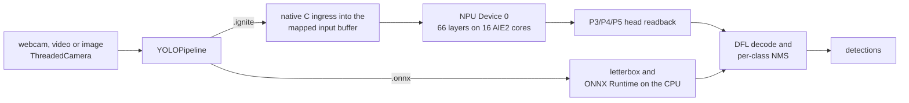

# Ignition performance

Every figure on this page was measured on a Ryzen 7 8700G (Phoenix NPU) under Windows 11. The README's badges read their numbers from this page.

## Ignition vs AMD's Ryzen AI stack

The same model (`yolov8n_cut_xint8.onnx`, AMD Quark XINT8) ran on the same image (`examples/assets/bus.jpg`) on a Ryzen 7 8700G. Each run had 50 warm-up and 500 timed frames. Runs alternated AMD, Ignition, AMD, Ignition, with the NPU checked idle before each, and both runs are shown in every cell. Ignition ran on ignite-xdna `5688f6d`.

| | **Ignition** | **AMD Ryzen AI Software 1.7.1** ONNX Runtime + Vitis AI EP |
|---|---|---|
| **End-to-end latency, mean** | **7.78 / 7.75 ms** | 10.37 / 10.33 ms |
| End-to-end latency, 95th percentile | **8.02 / 7.96 ms** | 10.93 / 10.98 ms |
| ↳ image preparation (letterbox, quantize) | **0.31 / 0.31 ms**, native code into the NPU's buffer | 1.72 / 1.73 ms |
| ↳ NPU | 7.43 / 7.41 ms | **6.71 / 6.70 ms** |
| ↳ box decode and NMS | **0.033 / 0.031 ms**, native code | 1.94 / 1.90 ms |
| **Process memory (RSS)** | **192.7 / 192.5 MB** | 305.4 / 306.3 MB |
| **Runtime install on disk** | **≈318 MB** | ≈4,704 MB |
| Detections on `bus.jpg` | 4 people, 1 bus | the same 5 objects (box IoU 0.93–0.99) |
| Where the network runs | all 66 layers on the NPU | 922 of 929 graph nodes on the NPU; 7 quantize/dequantize nodes on the CPU |
| Models it accelerates | YOLOv8n in a release; YOLOv8s, SESR M7, YOLOv8n-pose and YOLO11n (attention matrix multiplies and softmax on the CPU) with ignite-xdna from source; other `.onnx` models run on the CPU | any ONNX model its compiler accepts |
| Before the first run | a compiled `.ignite` container (a one-time build with ignite-xdna) | none: the model compiles on its first session and is cached |

**What the comparison does and does not show:**
- **Where Ignition's lead comes from.** It is entirely in host-side code. AMD's runtime executes the network and leaves image preparation and box decoding to your application, so the AMD column uses Ignition's reference numpy versions of those steps. Ignition ships them as native code. Hand-written native pre- and post-processing on AMD's stack would narrow the gap.
- **Where AMD is ahead.** AMD's NPU stage itself is about 0.7 ms faster than Ignition's. AMD's stack also runs a much wider range of models, and its current release targets newer NPUs.
- **What the disk figures count.** AMD's covers the Ryzen AI 1.7.1 install (4,072 MB), its ONNX Runtime with the Vitis AI EP (615 MB), `voe` (3 MB) and the compile cache (14 MB). Ignition's covers the XRT SDK with `pyxrt` (262 MB), ONNX Runtime for the CPU fallback (44 MB), ignite-xdna (3 MB), the `.ignite` container (8 MB) and Ignition itself (66 KB). Neither counts Python, numpy, OpenCV or the NPU driver. Building a container needs the mlir-aie toolchain, which is not counted.
- **Why the AMD column uses 1.7.1.** In this project's testing, Ryzen AI Software 1.8.0 installed without the Phoenix/Hawk Point xclbin that its own documentation calls for, and rejected the driver's XDNA1 xclbins, so NPU inference on these chips stays on 1.7.1. That looks like a packaging bug, reported upstream as [amd/RyzenAI-SW#400](https://github.com/amd/RyzenAI-SW/issues/400) ([ignite-xdna decision record](https://github.com/jdominick05/ignite-xdna/blob/main/docs/DECISIONS.md)).

## YOLOv8n through live_ignition.py

The table's figures come from YOLOv8n on NPU Device 0 of a Ryzen 7 8700G; [other models](#other-models) follow it:
- **Setup:** Windows 11, `build/yolov8n_full.ignite`, webcam 0 through DirectShow at 640×480, 10 warm-up frames per run unless the command sets `--warmup`. Rows with a commit ran ignite-xdna `v0.1.0-phoenix-npu`, which decodes boxes in numpy and runs NMS through OpenCV; *re-check* rows ran ignite-xdna `5688f6d`, which does both in one native C pass.
- **Records:** each row names the commit whose message records the run. *Re-check* rows were measured on 2026-09-14 and are recorded in the commit that added them to the README.

| `live_ignition.py` run | Scene | Timed frames | Objects / frame | Mean | 99th pct | Record |
|---|---|---:|---:|---:|---:|---|
| `--headless --frames 300` | webcam, dark room | 300 | 0 | 7.58 ms | 7.91 ms | `ee66fbd` |
| `--headless --frames 300` | webcam, lit room | 300 | 5.44 | 7.82 ms | 8.18 ms | `8ffa482` |
| `--headless --frames 300` | webcam, lit room | 300 | 5.27 | 7.87 ms | 8.58 ms | `8ffa482` |
| `--headless --frames 300` | webcam, lit room | 300 | 5.43 | 7.89 ms | 8.39 ms | `0f374e5` |
| `--headless --frames 300` | webcam, lit room | 300 | 4.62 | 7.49 ms | 7.79 ms | re-check |
| `--headless --frames 500` | webcam, lit room | 500 | 5.90 | 8.02 ms | 8.55 ms | `8ffa482` |
| `--headless --frames 300 --fresh` | webcam, every frame new | 300 | 5.00 | 8.03 ms | 8.51 ms | `8ffa482` |
| window, closed with q | webcam, lit room | 714 | 5.74 | 7.98 ms | 8.52 ms | `8ffa482` |
| `--source` a 640×480 crop of `bus.jpg`, `--headless --frames 500` | still image | 500 | 4.00 | 7.86 ms | 8.39 ms | `ee66fbd` |
| `--source examples/assets/bus.jpg --headless --frames 300` | still image, 810×1080 | 300 | 5.00 | 8.06 ms | 8.67 ms | `0f374e5` |
| `--source examples/assets/bus.jpg --headless --warmup 50 --frames 500` | still image, 810×1080 | 500 | 5.00 | 7.78 ms | 8.28 ms | re-check |
| `--source examples/assets/bus.jpg --headless --warmup 50 --frames 500` | still image, 810×1080 | 500 | 5.00 | 7.75 ms | 8.10 ms | re-check |

- **Frame rate:** Ignition's processing loop ran at 122 to 129 frames per second with the numpy decode and 133 to 134 with the native one, so the camera sets the live rate, and the camera's auto exposure sets that. The test webcam, a Logitech C920, delivered 30 distinct frames per second in a bright room and 15 in a dim one, whatever rate or pixel format was requested. In the dim room `--exposure-priority off` held 30, with 2.43 detections per frame against 5.55–6.06 at 15. Media Foundation reads at 30 fps partly by repeating frames, so the `[summary] camera:` line counts the distinct ones. With `--fresh`, each new frame became detections 8.10 ms after it arrived.
- **Decode and NMS:** in native code they took 0.030 ms with 4.62 objects per frame on the webcam and 0.031–0.033 ms with 5 on `bus.jpg`. The numpy and OpenCV version behind the rows with a commit took 0.25–0.33 ms with 5–6 objects in view and 0.05 ms on an empty scene.
- **Long runs:** resident memory did not grow: −1.12 MB over 500 webcam frames in a lit room, −1.15 MB over 500 in a dark one, +0.02 MB over 500 frames of a still image.
- **Clean exit:** every run exited cleanly and released the NPU; afterwards `xrt-smi` reported no hardware contexts running.

## Other models

Measured on 2026-09-14 through `live_ignition.py` with ignite-xdna `68c2fea` and containers built from it, on `examples/assets/bus.jpg` with 10 warm-up and 300 timed frames, one run each; recorded in the commit that added this section. The [same-sitting comparison with AMD's stack](#yolov8s-and-sesr-m7-against-amds-stack) re-measured YOLOv8s and SESR M7 on 2026-09-15.

| Model | Task | Runs on | Mean | 99th pct | Output |
|---|---|---|---:|---:|---|
| YOLOv8s | detect | NPU | 17.22 ms | 17.62 ms | 6 objects |
| SESR M7 | super_resolution | NPU | 6.59 ms | 7.36 ms | 512×512 image |
| SESR M7 | super_resolution | CPU (ONNX Runtime) | 13.99 ms | 18.68 ms | 512×512 image |
| ResNet50 | classify | CPU (ONNX Runtime) | 30.49 ms | 40.09 ms | top-1 ImageNet class 654 (minibus), p = 0.58 |

- **Where the time goes:** YOLOv8s spent 16.66 ms in NPU dispatch and 0.040 ms in native decode and NMS. SESR M7 spent 4.33 ms in NPU dispatch and 1.91 ms in host post-processing of its output.
- **On the webcam:** SESR M7 took 6.51 ms per frame on webcam 0 at 640×480.

## YOLOv8s and SESR M7 against AMD's stack

Measured on 2026-09-15 (UTC) in one sitting with the toolchain `install.ps1` installs (ignite-xdna `9351cc1`, Ignition `6985ef7`), on `examples/assets/bus.jpg` with 50 warm-up and 500 timed frames per run. Both containers were built in the sitting and matched their models on every layer (66/66 and 9/9). AMD's runs used Ignition's own pre- and post-processing, and `xrt-smi` reported no hardware contexts before every run. The record is ignite-xdna's `results/aie/yolov8s_sesr_vs_amd_phoenix_20260915T2146Z.log`.

| Run | Stack | Model | Mean | 99th pct | Where the time goes | Output | Memory |
|---|---|---|---:|---:|---|---|---:|
| 1 | AMD Ryzen AI Software 1.7.1 (ONNX Runtime + Vitis AI EP) | YOLOv8s | **16.95 ms** | 17.83 ms | letterbox 1.83 ms, `session.run` 13.14 ms, decode and NMS 1.99 ms | 5 objects | 553.0 MB |
| 2 | Ignition on the container | YOLOv8s | 17.24 ms | 17.55 ms | NPU dispatch 16.70 ms, decode and NMS 0.035 ms | 6 objects | **242.0 MB** |
| 3 | AMD Ryzen AI Software 1.7.1 (ONNX Runtime + Vitis AI EP) | YOLOv8s | **16.96 ms** | 17.87 ms | letterbox 1.78 ms, `session.run` 13.17 ms, decode and NMS 2.01 ms | 5 objects | 339.2 MB |
| 4 | Ignition on the container | YOLOv8s | 17.27 ms | 17.58 ms | NPU dispatch 16.74 ms, decode and NMS 0.033 ms | 6 objects | **242.0 MB** |
| 5 | AMD Ryzen AI Software 1.7.1 (ONNX Runtime + Vitis AI EP) | SESR M7 | **3.65 ms** | 4.41 ms | preprocess 0.32 ms, `session.run` 1.46 ms, image output 1.87 ms | 512×512 image | 294.8 MB |
| 6 | Ignition on the container | SESR M7 | 6.67 ms | 7.40 ms | preprocess 0.32 ms, NPU dispatch 4.41 ms, image output 1.92 ms | 512×512 image | **162.1 MB** |
| 7 | AMD Ryzen AI Software 1.7.1 (ONNX Runtime + Vitis AI EP) | SESR M7 | **3.63 ms** | 4.29 ms | preprocess 0.32 ms, `session.run` 1.47 ms, image output 1.84 ms | 512×512 image | 265.0 MB |
| 8 | Ignition on the container | SESR M7 | 6.66 ms | 7.51 ms | preprocess 0.32 ms, NPU dispatch 4.39 ms, image output 1.93 ms | 512×512 image | **162.1 MB** |

- **AMD's stack is faster on both models.** Its NPU stage is shorter: `session.run` took 13.14–13.17 ms on YOLOv8s against Ignition's 16.70–16.74 ms dispatch, and 1.46–1.47 ms on SESR M7 against 4.39–4.41 ms. On YOLOv8s, Ignition's native letterbox and decode (about 0.3 ms against AMD's 3.8 ms) win back most of that gap, not all of it; on SESR M7 both stacks run the same numpy image output.
- **Why Ignition's NPU stage is slower:** the engine moves every layer's activations and weights between host memory and the NPU each frame. With no compute at all, SESR M7's dispatch still took 2.53 ms ([ignite-xdna's model zoo notes](https://github.com/jdominick05/ignite-xdna/blob/main/docs/MODEL_ZOO_BENCHMARKS.md)). Keeping that data on the chip does not help: holding activations or weights in the NPU's MemTile was built in ignite-xdna, byte-exact, and was 3.40 and 3.63 ms slower on YOLOv8s, and no other runtime change measured or sized there closes the YOLOv8s gap, so it is a known limitation of this runtime ([ignite-xdna's measurements](https://github.com/jdominick05/ignite-xdna/blob/main/docs/BENCHMARKS.md#memtile-residency-does-not-pay-on-the-graph-engine-and-the-yolov8s-gap-is-a-known-limitation-2026-09-16-desktop-2)).
- **Memory:** Ignition used 242.0 MB on YOLOv8s and 162.1 MB on SESR M7, flat over each run. AMD's stack used 339.2 and 265.0–294.8 MB, and 553.0 MB in its first YOLOv8s session, which also compiled the model.
- **Why 6 objects against 5:** given the same input, the container matched ONNX Runtime on every layer. As with YOLO11n, Ignition's native letterbox rounds some input values one code differently, which moves borderline boxes.

## YOLO11n with its attention block

Measured on 2026-09-15 (UTC) in one sitting with ignite-xdna `d223e7b`'s runtime, on `examples/assets/bus.jpg` with 50 warm-up and 500 timed frames per run. Runs alternated AMD's stack, a container with YOLO11n's whole C2PSA attention block on the CPU (built at ignite-xdna `06aef68`) and one with only its attention core there (built with `d223e7b`'s compiler), and `xrt-smi` reported no hardware contexts before and after every run. AMD's runs used the Vitis AI loop of Ignition's `benchmarks/benchmark_yolo_vitisai.py`, with Ignition's numpy letterbox and decode. The record is ignite-xdna's `results/aie/yolo11n_attention_core_phoenix_20260915T1522Z.log`.

| Run | Stack | Mean | 99th pct | Where the time goes | Objects |
|---|---|---:|---:|---|---:|
| 1 | AMD Ryzen AI Software 1.7.1 (ONNX Runtime + Vitis AI EP) | 36.36 ms | 54.73 ms | `session.run` 32.54 ms | 7 |
| 2 | Ignition, whole attention block on the CPU | 11.11 ms | 11.71 ms | NPU dispatch 8.37 ms, CPU step 1.73 ms | 6 |
| 3 | Ignition, attention core on the CPU | **10.41 ms** | 12.61 ms | NPU dispatch 8.78 ms, CPU step 0.53 ms | 6 |
| 4 | AMD Ryzen AI Software 1.7.1 (ONNX Runtime + Vitis AI EP) | 34.55 ms | 37.85 ms | `session.run` 30.87 ms | 7 |
| 5 | Ignition, whole attention block on the CPU | 10.99 ms | 11.30 ms | NPU dispatch 8.44 ms, CPU step 1.70 ms | 6 |
| 6 | Ignition, attention core on the CPU | **10.12 ms** | 10.62 ms | NPU dispatch 8.71 ms, CPU step 0.51 ms | 6 |

- **What moved to the NPU:** most of the attention block's CPU time went to its convolutions and their quantize and dequantize steps, which the NPU already runs exactly. With the block's seven convolutions and its residual adds on the NPU, the CPU step fell from 1.71 to 0.52 ms and NPU dispatch rose from 8.40 to 8.75 ms, 0.79 ms less per frame. Both containers' boxes equal ONNX Runtime's CPU decode of the same input ([how](https://github.com/jdominick05/ignite-xdna/blob/main/docs/BENCHMARKS.md#yolo11ns-c2psa-convolutions-on-the-npu-only-its-attention-core-on-the-host-2026-09-15-desktop-2)).
- **Why AMD's stack is slow here:** its Vitis AI EP rejects the attention block's 4-D matrix multiplies and places 6 of the model's 1,300 graph nodes on the NPU ([ignite-xdna's notes](https://github.com/jdominick05/ignite-xdna/blob/main/docs/BENCHMARKS.md#stock-yolo11n-with-its-c2psa-attention-block-npu-segments-around-a-host-step-2026-09-15-desktop-2)). In an earlier sitting, recorded in ignite-xdna's `results/aie/yolo11n_hybrid_phoenix_20260915T0216Z.log`, it was slower than ONNX Runtime's CPU provider alone (34.49 and 34.37 ms against 31.33 ms).
- **Why 6 objects against 7:** Ignition's boxes equal ONNX Runtime's CPU decode of the same NPU input (IoU 1.0). The runs differ in their input. AMD's stack uses Ignition's numpy letterbox, and Ignition's NPU path uses its native ingress. Both place the image identically, but 15% of the pixel codes differ by one. On the numpy letterbox, ONNX Runtime's CPU provider finds the classes AMD's stack reported: five people, a bus and a handbag. On the native input it finds four people, a bus and a train. No accuracy was measured.
- **Memory:** resident memory was 201.7 and 202.0 MB with the attention core on the CPU and 203.9 and 203.2 MB with the whole block, unchanged over each run, against 343.4 and 342.8 MB for AMD's stack.

## YOLOv8n-pose on the NPU

Measured on 2026-09-15 (UTC) in one sitting, with ignite-xdna's pose support and a container built from it, on `examples/assets/bus.jpg` with 50 warm-up and 500 timed frames per run; `xrt-smi` reported no hardware contexts before and after every run. ignite-xdna's `pipelines/yolov8n-pose/4_pose.py` timed AMD's stack and the container the same way, from the frame to the list of people, with its numpy letterbox for AMD's stack; runs 3 and 6 are Ignition's `live_ignition.py` on the same container. The record is ignite-xdna's `results/aie/yolov8n_pose_phoenix_20260915T1919Z.log`.

| Run | Stack | Mean | 99th pct | Where the time goes | People |
|---|---|---:|---:|---|---:|
| 1 | AMD Ryzen AI Software 1.7.1 (ONNX Runtime + Vitis AI EP) | 12.06 ms | 13.31 ms | letterbox 2.96 ms, `session.run` and head decode 8.89 ms | 3 |
| 2 | ignite-xdna's pose pipeline on the container | **8.32 ms** | 8.77 ms | letterbox into the NPU's buffer 0.32 ms, NPU and head decode 7.92 ms | 3 |
| 3 | Ignition on the container | 8.36 ms | 8.86 ms | NPU dispatch 7.55 ms, decode and NMS 0.29 ms | 3 |
| 4 | AMD Ryzen AI Software 1.7.1 (ONNX Runtime + Vitis AI EP) | 12.09 ms | 13.18 ms | letterbox 3.00 ms, `session.run` and head decode 8.87 ms | 3 |
| 5 | ignite-xdna's pose pipeline on the container | **8.34 ms** | 8.82 ms | letterbox into the NPU's buffer 0.32 ms, NPU and head decode 7.94 ms | 3 |
| 6 | Ignition on the container | 8.48 ms | 9.11 ms | NPU dispatch 7.57 ms, decode and NMS 0.32 ms | 3 |

- **Where the lead comes from:** 2.66 ms of the 3.74 ms per frame is the letterbox, which AMD's runtime leaves to the application and the container does in native code straight into the NPU's buffer; 0.95 ms is the network and head decode.
- **Accuracy through the container:** on all 5,000 COCO val2017 images the container scored 32.77 OKS mAP@50-95 (67.82 mAP@50) with its native letterbox. Given the numpy letterbox instead, its detections were byte-identical to ONNX Runtime's CPU provider's (32.71); AMD's stack was recorded at 32.64 on that input ([ignite-xdna's notes](https://github.com/jdominick05/ignite-xdna/blob/main/docs/BENCHMARKS.md#yolov8n-pose-on-the-graph-engine-every-layer-on-the-npu-keypoints-through-the-container-2026-09-15-desktop-2)).
- **Why 3 people:** on `bus.jpg` both stacks report 3 people. On the numpy letterbox the container, like ONNX Runtime's CPU provider, finds 4, so AMD's execution provider and the native letterbox each lose one.
- **Decode:** keypoint decode and NMS run in numpy, 0.29–0.32 ms per frame against 0.03 ms for YOLOv8n's native decode.
- **Memory:** Ignition's resident memory was 182.1 MB, unchanged over each run.

## How a frame runs

Latency is measured glass to glass: from the moment the loop takes a frame to the moment its detections exist. Drawing and display come after it.

| Stage (native path) | What happens | Mean per frame |
|---|---|---:|
| Ingress | One native C pass (OpenMP) letterboxes, resizes and quantizes the frame straight into the NPU's mapped input buffer | 0.133 ms |
| NPU dispatch | One run of ignite-xdna's graph-engine program computes all 66 layers on the 16 AIE2 cores | 7.122 ms |
| Head readback | The P3, P4 and P5 box and class tensors are read from the output buffer | 0.195 ms |
| Decode and NMS | One native C pass decodes DFL boxes for the anchors that clear the confidence threshold and runs per-class non-maximum suppression on the host | 0.030 ms |

These stage times come from the webcam re-check above: 640×480 frames with 4.62 objects per frame. A larger source costs more at ingress; the 810×1080 `bus.jpg` in the AMD comparison took 0.31 ms.
- **What the NPU time is spent on:** activations move between host memory and the NPU between layers, so most of the dispatch is data movement. A copy of the container with every weight operation switched off still took 5.37 ms of a 7.39 ms dispatch (ignite-xdna `results/model_zoo/dispatch_floor_yolov8n_full.json`).
- **Host segments:** a YOLO11n container runs its attention core (two matrix multiplies and a softmax) on ONNX Runtime's CPU provider between its two NPU dispatches, reading and writing the NPU's workspace buffer, and reports that step as `host`. It calls ONNX Runtime once per frame; a YOLOv8n container never does.
- **The CPU fallback:** an `.onnx` model runs the same steps on ONNX Runtime's CPU execution provider instead.
- **Other tasks:** the diagram shows detection. `SuperResolutionPipeline` runs an `.ignite` container through ignite-xdna's super-resolution pipeline on the NPU, or an `.onnx` model on ONNX Runtime. `PosePipeline` runs a pose container through ignite-xdna's pose pipeline on the NPU, or a head-cut YOLOv8-pose `.onnx` model on ONNX Runtime, and both decode keypoints with ignite-xdna's decoder. `ClassificationPipeline` runs on ONNX Runtime only.
- **The camera:** a capture thread (`ThreadedCamera`) owns the webcam so sensor I/O never stalls inference. It tries DirectShow, then Media Foundation, abandons a backend that does not open within `--open-timeout`, and skips empty frames. It counts the frames it reads and the ones that repeat the previous frame. q, ESC, closing the window, Ctrl+C and Ctrl+Break all release the camera and the NPU.
