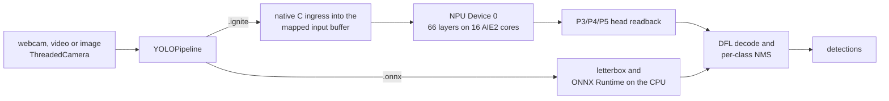

# Ignition performance

Every figure on this page was measured on a Ryzen 7 8700G (Phoenix NPU) under Windows 11. The README's badges read their numbers from this page.

## Ignition vs AMD's Ryzen AI stack

The same model (`yolov8n_cut_xint8.onnx`, AMD Quark XINT8) ran on the same image (`examples/assets/bus.jpg`) on a Ryzen 7 8700G. Each run had 50 warm-up and 500 timed frames. Runs alternated AMD's stack, Ignition in its default `balanced` power mode and Ignition with `--power-mode performance`, twice, with the NPU checked idle before each group, and both runs are shown in every cell. Measured on 2026-09-16 (UTC) with ignite-xdna 0.3.0 (`554ab57`) and Ignition v0.3.2; the record is ignite-xdna's `results/aie/latency_balanced_default_phoenix_20260916T1745Z.log`.

| | **Ignition** (default power mode) | **AMD Ryzen AI Software 1.7.1** ONNX Runtime + Vitis AI EP | Ignition, `--power-mode performance` |
|---|---|---|---|
| **End-to-end latency, mean** | **8.42 / 8.39 ms** | 10.39 / 10.34 ms | 7.98 / 7.96 ms |
| End-to-end latency, 95th percentile | **8.74 / 8.69 ms** | 10.86 / 10.82 ms | 8.09 / 8.14 ms |
| ↳ image preparation (letterbox, quantize) | **0.55 / 0.53 ms**, native code into the NPU's buffer | 1.78 / 1.77 ms | 0.42 / 0.42 ms |
| ↳ NPU (dispatch and head readback) | 7.83 / 7.80 ms | **6.54 / 6.51 ms** | 7.52 / 7.50 ms |
| ↳ box decode and NMS | **0.041 / 0.042 ms**, native code | 2.07 / 2.05 ms | 0.036 / 0.037 ms |
| **Process memory (RSS)** | **191.8 / 191.7 MB** | 305.3 / 304.8 MB | 191.8 / 192.1 MB |
| **Runtime install on disk** | **≈318 MB** | ≈4,704 MB | the same install |
| Detections on `bus.jpg` | 4 people, 1 bus | the same 5 objects (box IoU 0.93–0.99) | 5 objects |
| Where the network runs | all 66 layers on the NPU | 922 of 929 graph nodes on the NPU; 7 quantize/dequantize nodes on the CPU | all 66 layers on the NPU |
| Models it accelerates | YOLOv8n in a release; YOLOv8s, SESR M7, YOLOv8n-pose and YOLO11n (attention matrix multiplies and softmax on the CPU) with ignite-xdna from source; other `.onnx` models run on the CPU | any ONNX model its compiler accepts | |
| Before the first run | a compiled `.ignite` container (a one-time build with ignite-xdna) | none: the model compiles on its first session and is cached | |

**What the comparison does and does not show:**
- **Where Ignition's lead comes from.** It is entirely in host-side code. AMD's runtime executes the network and leaves image preparation and box decoding to your application, so the AMD column uses Ignition's reference numpy versions of those steps. Ignition ships them as native code. Hand-written native pre- and post-processing on AMD's stack would narrow the gap.
- **What the default power mode costs.** `balanced` lets Ignition's host threads sleep between frames. It is 0.43 ms slower than `performance` on the means, and none of that is on the NPU. Preparation takes 0.12 ms longer, and the head readback after the NPU's wait 0.60 against 0.28 ms. In exchange it spends about a third of `performance`'s energy per frame ([energy per frame](#energy-per-frame-against-amds-stack)). Before power modes existed Ignition always spun: that sitting, from an `install.ps1` installation of ignite-xdna `5688f6d`, read 7.78 / 7.75 ms against AMD's 10.37 / 10.33 ms (recorded in `ffdefad`).
- **Where AMD is ahead.** AMD's NPU stage itself is about 1.3 ms faster than Ignition's in the default mode and 1.0 ms in `performance`. This sitting counted 5 detections per frame in every run; the class split, box IoU and node placement come from the `ffdefad` one. AMD's stack also runs a much wider range of models, and its current release targets newer NPUs.
- **What the disk figures count.** AMD's covers the Ryzen AI 1.7.1 install (4,072 MB), its ONNX Runtime with the Vitis AI EP (615 MB), `voe` (3 MB) and the compile cache (14 MB). Ignition's covers the XRT SDK with `pyxrt` (262 MB), ONNX Runtime for the CPU fallback (44 MB), ignite-xdna (3 MB), the `.ignite` container (8 MB) and Ignition itself (66 KB). Neither counts Python, numpy, OpenCV or the NPU driver. Building a container needs the mlir-aie toolchain, which is not counted.
- **Why the AMD column uses 1.7.1.** In this project's testing, Ryzen AI Software 1.8.0 installed without the Phoenix/Hawk Point xclbin that its own documentation calls for, and rejected the driver's XDNA1 xclbins, so NPU inference on these chips stays on 1.7.1. That looks like a packaging bug, reported upstream as [amd/RyzenAI-SW#400](https://github.com/amd/RyzenAI-SW/issues/400) ([ignite-xdna decision record](https://github.com/jdominick05/ignite-xdna/blob/main/docs/DECISIONS.md)).

## YOLOv8n through live_ignition.py

The table's figures come from YOLOv8n on NPU Device 0 of a Ryzen 7 8700G; [other models](#other-models) follow it:
- **Setup:** Windows 11, `build/yolov8n_full.ignite`, webcam 0 through DirectShow at 640×480, 10 warm-up frames per run unless the command sets `--warmup`. Rows with a commit ran ignite-xdna `v0.1.0-phoenix-npu`, which decodes boxes in numpy and runs NMS through OpenCV; *re-check* rows ran ignite-xdna `5688f6d`, which does both in one native C pass.
- **Records:** each row names the commit whose message records the run. *Re-check* rows were measured on 2026-09-14 and are recorded in the commit that added them to the README.
- **Power mode:** every row predates power modes, so Ignition's host threads spun between frames, which is `--power-mode performance` today. In the default mode expect about 0.4 ms more per frame ([the AMD comparison](#ignition-vs-amds-ryzen-ai-stack)).

| `live_ignition.py` run | Scene | Timed frames | Objects / frame | Mean | 99th pct | Record |
|---|---|---:|---:|---:|---:|---|
| `--headless --frames 300` | webcam, dark room | 300 | 0 | 7.58 ms | 7.91 ms | `ee66fbd` |
| `--headless --frames 300` | webcam, lit room | 300 | 5.44 | 7.82 ms | 8.18 ms | `8ffa482` |
| `--headless --frames 300` | webcam, lit room | 300 | 5.27 | 7.87 ms | 8.58 ms | `8ffa482` |
| `--headless --frames 300` | webcam, lit room | 300 | 5.43 | 7.89 ms | 8.39 ms | `0f374e5` |
| `--headless --frames 300` | webcam, lit room | 300 | 4.62 | 7.49 ms | 7.79 ms | re-check |
| `--headless --frames 500` | webcam, lit room | 500 | 5.90 | 8.02 ms | 8.55 ms | `8ffa482` |
| `--headless --frames 300 --fresh` | webcam, every frame new | 300 | 5.00 | 8.03 ms | 8.51 ms | `8ffa482` |
| window, closed with q | webcam, lit room | 714 | 5.74 | 7.98 ms | 8.52 ms | `8ffa482` |
| `--source` a 640×480 crop of `bus.jpg`, `--headless --frames 500` | still image | 500 | 4.00 | 7.86 ms | 8.39 ms | `ee66fbd` |
| `--source examples/assets/bus.jpg --headless --frames 300` | still image, 810×1080 | 300 | 5.00 | 8.06 ms | 8.67 ms | `0f374e5` |
| `--source examples/assets/bus.jpg --headless --warmup 50 --frames 500` | still image, 810×1080 | 500 | 5.00 | 7.78 ms | 8.28 ms | re-check |
| `--source examples/assets/bus.jpg --headless --warmup 50 --frames 500` | still image, 810×1080 | 500 | 5.00 | 7.75 ms | 8.10 ms | re-check |

- **Frame rate:** Ignition's processing loop ran at 122 to 129 frames per second with the numpy decode and 133 to 134 with the native one, so the camera sets the live rate, and the camera's auto exposure sets that. The test webcam, a Logitech C920, delivered 30 distinct frames per second in a bright room and 15 in a dim one, whatever rate or pixel format was requested. In the dim room `--exposure-priority off` held 30, with 2.43 detections per frame against 5.55–6.06 at 15. Media Foundation reads at 30 fps partly by repeating frames, so the `[summary] camera:` line counts the distinct ones. With `--fresh`, each new frame became detections 8.10 ms after it arrived.
- **Decode and NMS:** in native code they took 0.030 ms with 4.62 objects per frame on the webcam and 0.031–0.033 ms with 5 on `bus.jpg`. The numpy and OpenCV version behind the rows with a commit took 0.25–0.33 ms with 5–6 objects in view and 0.05 ms on an empty scene.
- **Long runs:** resident memory did not grow: −1.12 MB over 500 webcam frames in a lit room, −1.15 MB over 500 in a dark one, +0.02 MB over 500 frames of a still image.
- **Clean exit:** every run exited cleanly and released the NPU; afterwards `xrt-smi` reported no hardware contexts running.

## Other models

Measured on 2026-09-14 through `live_ignition.py` with ignite-xdna `68c2fea` and containers built from it, on `examples/assets/bus.jpg` with 10 warm-up and 300 timed frames, one run each; recorded in the commit that added this section. They predate power modes, so Ignition's host threads spun. The [same-sitting comparison with AMD's stack](#yolov8s-and-sesr-m7-against-amds-stack) re-measured YOLOv8s and SESR M7 in the default power mode on 2026-09-16.

| Model | Task | Runs on | Mean | 99th pct | Output |
|---|---|---|---:|---:|---|
| YOLOv8s | detect | NPU | 17.22 ms | 17.62 ms | 6 objects |
| SESR M7 | super_resolution | NPU | 6.59 ms | 7.36 ms | 512×512 image |
| SESR M7 | super_resolution | CPU (ONNX Runtime) | 13.99 ms | 18.68 ms | 512×512 image |
| ResNet50 | classify | CPU (ONNX Runtime) | 30.49 ms | 40.09 ms | top-1 ImageNet class 654 (minibus), p = 0.58 |

- **Where the time goes:** YOLOv8s spent 16.66 ms in NPU dispatch and 0.040 ms in native decode and NMS. SESR M7 spent 4.33 ms in NPU dispatch and 1.91 ms in host post-processing of its output.
- **On the webcam:** SESR M7 took 6.51 ms per frame on webcam 0 at 640×480.

## YOLOv8s and SESR M7 against AMD's stack

Measured on 2026-09-16 (UTC) in one sitting with Ignition in its default power mode, ignite-xdna 0.3.0 (`554ab57`) and Ignition v0.3.2, on `examples/assets/bus.jpg` with 50 warm-up and 500 timed frames per run. Both containers first matched their models on every layer (66/66 and 9/9). AMD's runs used Ignition's own pre- and post-processing, and `xrt-smi` reported no hardware contexts before every pair of runs. The record is ignite-xdna's `results/aie/latency_balanced_default_phoenix_20260916T1745Z.log`.

| Run | Stack | Model | Mean | 99th pct | Where the time goes | Output | Memory |
|---|---|---|---:|---:|---|---|---:|
| 1 | AMD Ryzen AI Software 1.7.1 (ONNX Runtime + Vitis AI EP) | YOLOv8s | **16.74 ms** | 17.57 ms | letterbox 1.78 ms, `session.run` 12.79 ms, decode and NMS 2.17 ms | 5 objects | 337.3 MB |
| 2 | Ignition on the container | YOLOv8s | 18.05 ms | 18.55 ms | preprocess 0.55 ms, NPU dispatch 16.79 ms, readback 0.65 ms, decode and NMS 0.047 ms | 6 objects | **241.8 MB** |
| 3 | AMD Ryzen AI Software 1.7.1 (ONNX Runtime + Vitis AI EP) | YOLOv8s | **16.56 ms** | 17.24 ms | letterbox 1.76 ms, `session.run` 12.67 ms, decode and NMS 2.14 ms | 5 objects | 339.6 MB |
| 4 | Ignition on the container | YOLOv8s | 17.99 ms | 18.57 ms | preprocess 0.55 ms, NPU dispatch 16.76 ms, readback 0.64 ms, decode and NMS 0.046 ms | 6 objects | **242.9 MB** |
| 5 | AMD Ryzen AI Software 1.7.1 (ONNX Runtime + Vitis AI EP) | SESR M7 | **4.37 ms** | 4.90 ms | preprocess 0.41 ms, `session.run` 1.49 ms, image output 2.46 ms | 512×512 image | 265.3 MB |
| 6 | Ignition on the container | SESR M7 | 6.84 ms | 7.34 ms | preprocess 0.43 ms, NPU dispatch 4.18 ms, image output 2.20 ms | 512×512 image | **163.4 MB** |
| 7 | AMD Ryzen AI Software 1.7.1 (ONNX Runtime + Vitis AI EP) | SESR M7 | **4.33 ms** | 4.92 ms | preprocess 0.42 ms, `session.run` 1.50 ms, image output 2.42 ms | 512×512 image | 265.3 MB |
| 8 | Ignition on the container | SESR M7 | 6.82 ms | 7.22 ms | preprocess 0.43 ms, NPU dispatch 4.18 ms, image output 2.18 ms | 512×512 image | **162.9 MB** |

- **AMD's stack is faster on both models.** Its NPU stage is shorter: `session.run` took 12.67–12.79 ms on YOLOv8s against Ignition's 16.76–16.79 ms dispatch, and 1.49–1.50 ms on SESR M7 against 4.18 ms. On YOLOv8s the rest of Ignition's frame took 1.24 ms against AMD's 3.92 ms, which does not win the gap back. On SESR M7 both stacks run the same numpy image output.
- **The gap on YOLOv8s depends on the power mode.** In the default mode it is 1.36 ms on the means. On 2026-09-15, with Ignition's host threads spinning and an `install.ps1` installation, it was 0.30 ms: 17.24 / 17.27 ms against AMD's 16.95 / 16.96 ms (ignite-xdna's `results/aie/yolov8s_sesr_vs_amd_phoenix_20260915T2146Z.log`). In a later energy sitting, 1,800 frames per run, `--power-mode performance` read 17.45 / 17.44 ms against AMD's 16.72 / 16.73 ms. AMD's SESR M7 run was 0.7 ms slower than on 2026-09-15 with nothing changed on its side, so compare rows within a sitting only.
- **Why Ignition's NPU stage is slower:** the engine moves every layer's activations and weights between host memory and the NPU each frame. With no compute at all, SESR M7's dispatch still took 2.53 ms ([ignite-xdna's model zoo notes](https://github.com/jdominick05/ignite-xdna/blob/main/docs/MODEL_ZOO_BENCHMARKS.md)). Keeping that data on the chip does not help: holding activations or weights in the NPU's MemTile was built in ignite-xdna, byte-exact, and was 3.40 and 3.63 ms slower on YOLOv8s, and no other runtime change measured or sized there closes the YOLOv8s gap, so it is a known limitation of this runtime ([ignite-xdna's measurements](https://github.com/jdominick05/ignite-xdna/blob/main/docs/BENCHMARKS.md#memtile-residency-does-not-pay-on-the-graph-engine-and-the-yolov8s-gap-is-a-known-limitation-2026-09-16-desktop-2)).
- **Memory:** Ignition used 241.8–242.9 MB on YOLOv8s and 162.9–163.4 MB on SESR M7, flat over each run. AMD's stack used 337.3–339.6 and 265.3 MB. Its sessions loaded models compiled earlier; on 2026-09-15 its first YOLOv8s session also compiled the model and used 553.0 MB.
- **Why 6 objects against 5:** given the same input, the container matched ONNX Runtime on every layer. As with YOLO11n, Ignition's native letterbox rounds some input values one code differently, which moves borderline boxes.

## YOLO11n with its attention block

Measured on 2026-09-16 (UTC) in one sitting with Ignition in its default power mode and ignite-xdna's runtime at `fbd53f5`, from source: since that commit the CPU step's ONNX Runtime threads follow the power mode instead of spinning. **`fbd53f5` is in no release yet.** With ignite-xdna 0.3.0, which the `npu` extra installs, the CPU step's threads spin in every mode, as in the 2026-09-15 figures quoted below. The images were `examples/assets/bus.jpg`, with 50 warm-up and 500 timed frames per run. Runs alternated AMD's stack, a container with YOLO11n's whole C2PSA attention block on the CPU, one with only its attention core there, and that one again with `--power-mode performance`. Both containers first matched their model on every layer, and `xrt-smi` reported no hardware contexts before every group and at the end. AMD's runs used ignite-xdna's `tools/amd_vitisai_yolo.py`, the Vitis AI loop of Ignition's `benchmarks/benchmark_yolo_vitisai.py` with Ignition's numpy letterbox and decode. The record is ignite-xdna's `results/aie/latency_yolo11n_host_power_modes_phoenix_20260916T2010Z.log`.

| Run | Stack | Mean | 99th pct | Where the time goes | Objects |
|---|---|---:|---:|---|---:|
| 1 | AMD Ryzen AI Software 1.7.1 (ONNX Runtime + Vitis AI EP) | 37.67 ms | 40.51 ms | `session.run` 33.78 ms | 7 |
| 2 | Ignition, whole attention block on the CPU | 11.59 ms | 12.59 ms | NPU dispatch 8.39 ms, CPU step 1.98 ms | 6 |
| 3 | Ignition, attention core on the CPU | **10.67 ms** | 11.40 ms | NPU dispatch 8.72 ms, CPU step 0.71 ms | 6 |
| 4 | AMD Ryzen AI Software 1.7.1 (ONNX Runtime + Vitis AI EP) | 37.70 ms | 40.98 ms | `session.run` 33.80 ms | 7 |
| 5 | Ignition, whole attention block on the CPU | 11.56 ms | 12.69 ms | NPU dispatch 8.39 ms, CPU step 1.95 ms | 6 |
| 6 | Ignition, attention core on the CPU | **10.63 ms** | 11.35 ms | NPU dispatch 8.73 ms, CPU step 0.73 ms | 6 |

- **What moved to the NPU:** most of the attention block's CPU time went to its convolutions and their quantize and dequantize steps, which the NPU already runs exactly. With the block's seven convolutions and its residual adds on the NPU, the CPU step fell from 1.97 to 0.72 ms and NPU dispatch rose from 8.39 to 8.72 ms, 0.92 ms less per frame. Both containers' boxes equal ONNX Runtime's CPU decode of the same input ([how](https://github.com/jdominick05/ignite-xdna/blob/main/docs/BENCHMARKS.md#yolo11ns-c2psa-convolutions-on-the-npu-only-its-attention-core-on-the-host-2026-09-15-desktop-2)).
- **The power mode and the CPU step:** with `--power-mode performance` the attention-core container ran 10.56 / 10.46 ms (CPU step 0.55 / 0.57 ms), 0.14 ms faster on the means for about three times the energy per frame ([energy per frame](#energy-per-frame-against-amds-stack)). Before `fbd53f5` the CPU step's threads spun in every mode: the 2026-09-15 sitting read 10.41 / 10.12 ms against AMD's 36.36 / 34.55 ms (ignite-xdna's `results/aie/yolo11n_attention_core_phoenix_20260915T1522Z.log`).
- **Why AMD's stack is slow here:** its Vitis AI EP rejects the attention block's 4-D matrix multiplies and places 6 of the model's 1,300 graph nodes on the NPU ([ignite-xdna's notes](https://github.com/jdominick05/ignite-xdna/blob/main/docs/BENCHMARKS.md#stock-yolo11n-with-its-c2psa-attention-block-npu-segments-around-a-host-step-2026-09-15-desktop-2)). In an earlier sitting, recorded in ignite-xdna's `results/aie/yolo11n_hybrid_phoenix_20260915T0216Z.log`, it was slower than ONNX Runtime's CPU provider alone (34.49 and 34.37 ms against 31.33 ms).
- **Why 6 objects against 7:** Ignition's boxes equal ONNX Runtime's CPU decode of the same NPU input (IoU 1.0). The runs differ in their input. AMD's stack uses Ignition's numpy letterbox, and Ignition's NPU path uses its native ingress. Both place the image identically, but 15% of the pixel codes differ by one. On the numpy letterbox, ONNX Runtime's CPU provider finds the classes AMD's stack reported: five people, a bus and a handbag. On the native input it finds four people, a bus and a train. No accuracy was measured.
- **Memory:** resident memory was 200.3 and 200.4 MB with the attention core on the CPU and 202.2 and 202.3 MB with the whole block, flat over each run, against 343.4 and 342.6 MB for AMD's stack.

## YOLOv8n-pose on the NPU

Measured on 2026-09-16 (UTC) in one sitting with Ignition in its default power mode, ignite-xdna 0.3.0 (`554ab57`) and Ignition v0.3.2, on ignite-xdna's `assets/bus.jpg` with 50 warm-up and 500 timed frames per run. The container first matched its model on every layer (75/75), and `xrt-smi` reported no hardware contexts before every group and at the end. ignite-xdna's `pipelines/yolov8n-pose/4_pose.py` timed AMD's stack and the container the same way, from the frame to the list of people, with its numpy letterbox for AMD's stack; runs 3 and 6 are Ignition's `live_ignition.py` on the same container. The record is ignite-xdna's `results/aie/latency_balanced_default_phoenix_20260916T1745Z.log`.

| Run | Stack | Mean | 99th pct | Where the time goes | People |
|---|---|---:|---:|---|---:|
| 1 | AMD Ryzen AI Software 1.7.1 (ONNX Runtime + Vitis AI EP) | 11.96 ms | 12.78 ms | letterbox 2.97 ms, `session.run` and head decode 8.72 ms | 3 |
| 2 | ignite-xdna's pose pipeline on the container | **8.99 ms** | 9.50 ms | letterbox into the NPU's buffer 0.57 ms, NPU and head decode 8.33 ms | 3 |
| 3 | Ignition on the container | 9.03 ms | 9.44 ms | NPU dispatch 7.56 ms, decode and NMS 0.31 ms | 3 |
| 4 | AMD Ryzen AI Software 1.7.1 (ONNX Runtime + Vitis AI EP) | 12.02 ms | 13.12 ms | letterbox 3.02 ms, `session.run` and head decode 8.72 ms | 3 |
| 5 | ignite-xdna's pose pipeline on the container | 9.04 ms | 9.60 ms | letterbox into the NPU's buffer 0.60 ms, NPU and head decode 8.35 ms | 3 |
| 6 | Ignition on the container | **8.97 ms** | 9.62 ms | NPU dispatch 7.53 ms, decode and NMS 0.32 ms | 3 |

- **Where the lead comes from:** Ignition's app ran 2.99 ms per frame ahead of AMD's stack on the means. Through the same script, 2.41 ms of the pipeline's 2.97 ms lead is the letterbox, which AMD's runtime leaves to the application and the container does in native code straight into the NPU's buffer; 0.38 ms is the network and head decode. On 2026-09-15, with Ignition's host threads spinning, the lead read 3.74 ms: 8.32 / 8.34 ms against 12.06 / 12.09 ms (ignite-xdna's `results/aie/yolov8n_pose_phoenix_20260915T1919Z.log`).
- **Accuracy through the container:** on all 5,000 COCO val2017 images the container scored 32.77 OKS mAP@50-95 (67.82 mAP@50) with its native letterbox. Given the numpy letterbox instead, its detections were byte-identical to ONNX Runtime's CPU provider's (32.71); AMD's stack was recorded at 32.64 on that input ([ignite-xdna's notes](https://github.com/jdominick05/ignite-xdna/blob/main/docs/BENCHMARKS.md#yolov8n-pose-on-the-graph-engine-every-layer-on-the-npu-keypoints-through-the-container-2026-09-15-desktop-2)).
- **Why 3 people:** on `bus.jpg` both stacks report 3 people. On the numpy letterbox the container, like ONNX Runtime's CPU provider, finds 4, so AMD's execution provider and the native letterbox each lose one.
- **Decode:** keypoint decode and NMS run in numpy, 0.31–0.32 ms per frame against 0.04 ms for YOLOv8n's native decode.
- **Memory:** Ignition's resident memory was 181.5 MB at the first timed frame and 181.6–181.7 MB at the end of each run.

## Energy per frame against AMD's stack

Measured on 2026-09-16 (UTC) with ignite-xdna's `tools/energy_sitting.py` on YOLOv8n and `examples/assets/bus.jpg`, the stacks interleaved in one sitting per table. The machine has no NPU power meter, so each figure is what the whole application added to the processor package's power (AMD RAPL) over an idle baseline taken right before it, divided by the frames it completed in the same window; start-up and warm-up are excluded. Ignition ran with each `--power-mode`, and AMD's arm is ONNX Runtime with the Vitis AI EP and Ignition's own letterbox and decode. Records: ignite-xdna's `results/aie/energy_power_modes_paced30_yolov8n_phoenix_20260916T1702Z.log` and `results/aie/energy_power_modes_yolov8n_phoenix_20260916T1645Z.log`.

**At a camera's 30 frames per second** (`--max-fps 30`, 1,200 frames per run):

| Run | Stack | Power mode | Mean G2G | CPU | Above idle | Energy per frame |
|---|---|---|---:|---:|---:|---:|
| 1 | AMD Ryzen AI Software 1.7.1 (ONNX Runtime + Vitis AI EP) | — | 11.04 ms | 8.4 % | 6.53 W | 217.6 mJ |
| 2 | Ignition on the container | performance | 7.98 ms | 99.9 % | 41.54 W | 1,384.8 mJ |
| 3 | Ignition on the container | balanced | 8.74 ms | 7.8 % | 5.91 W | **196.9 mJ** |
| 4 | Ignition on the container | efficiency | 9.53 ms | 7.9 % | 5.11 W | **170.3 mJ** |
| 5 | AMD Ryzen AI Software 1.7.1 (ONNX Runtime + Vitis AI EP) | — | 10.97 ms | 8.5 % | 6.01 W | 200.4 mJ |
| 6 | Ignition on the container | performance | 8.04 ms | 100.0 % | 41.15 W | 1,371.8 mJ |
| 7 | Ignition on the container | balanced | 8.80 ms | 7.8 % | 5.36 W | **178.7 mJ** |
| 8 | Ignition on the container | efficiency | 9.58 ms | 7.9 % | 4.77 W | **159.1 mJ** |

**As fast as each stack runs** (4,000 Ignition and 3,200 AMD frames per run):

| Run | Stack | Power mode | Frames per second | Mean G2G | CPU | Energy per frame |
|---|---|---|---:|---:|---:|---:|
| 1 | AMD Ryzen AI Software 1.7.1 (ONNX Runtime + Vitis AI EP) | — | 89.08 | 11.22 ms | 10.8 % | 126.6 mJ |
| 2 | Ignition on the container | performance | **125.81** | 7.93 ms | 99.9 % | 377.7 mJ |
| 3 | Ignition on the container | balanced | 119.06 | 8.38 ms | 11.1 % | 128.7 mJ |
| 4 | Ignition on the container | efficiency | 109.56 | 9.11 ms | 9.3 % | **114.7 mJ** |
| 5 | AMD Ryzen AI Software 1.7.1 (ONNX Runtime + Vitis AI EP) | — | 95.77 | 10.45 ms | 11.6 % | 123.5 mJ |
| 6 | Ignition on the container | performance | **126.25** | 7.91 ms | 100.0 % | 381.6 mJ |
| 7 | Ignition on the container | balanced | 119.11 | 8.38 ms | 10.5 % | 124.5 mJ |
| 8 | Ignition on the container | efficiency | 108.53 | 9.20 ms | 10.8 % | 120.7 mJ |

- **At 30 fps Ignition spends less than AMD's stack:** balanced, the default, 187.8 mJ per frame on the mean of its two runs against 209.0, and efficiency 164.7, 21 % less, while both stay ahead on latency. Both runs of each mode read lower than both of AMD's.
- **Flat out, the default matches AMD's energy per frame at 24–34 % more frames per second.** Efficiency's lower mean there is inside its own two runs' spread and is not claimed.
- **Performance mode keeps every worker thread spinning between frames:** the most frames per second, and at a camera's rate about 41 W for work the other modes do in 4.8–5.9 W. It was Ignition's only behaviour before power modes existed, because the setting meant to stop the spinning never reached MSVC's OpenMP runtime ([ignite-xdna's notes](https://github.com/jdominick05/ignite-xdna/blob/main/docs/BENCHMARKS.md#energy-per-frame-against-amds-stack-and-power-modes-2026-09-16-desktop-2)).
- **Scope:** one machine, an 8-core, 16-thread Ryzen 7 8700G. The modes size themselves to the host's cores; other hosts are unmeasured.

### Other models

Measured on 2026-09-16 (UTC) in two sittings, one flat out and one at 30 fps, with the same tool and ignite-xdna's runtime at `fbd53f5` from source. That runtime also puts a container's CPU step (YOLO11n's attention core) under the power mode. It is in no release yet, and with ignite-xdna 0.3.0 YOLO11n's CPU step spins in every mode, much like the `performance` rows. YOLO11n is the attention-core container. Frames per run flat out: 1,800 for YOLOv8s; 7,000 (AMD) and 4,500 (Ignition) for SESR M7; 900 and 3,000 for YOLO11n; 2,700 and 3,600 for YOLOv8n-pose. At 30 fps every run was 1,200 frames, and `performance` was not repeated there. Energy is against each sitting's median idle, 35.01 and 34.94 W, and both runs are shown. Two earlier sittings were discarded: a load that showed no CPU held idle about 5.5 W high, and control runs repeated on clean power read 13–25 % lower. Records: ignite-xdna's `results/aie/energy_power_modes_models_phoenix_20260916T2012Z.log` and `results/aie/energy_power_modes_paced30_models_phoenix_20260916T2049Z.log`.

| Model | Stack | Power mode | Frames per second, flat out | Energy per frame, flat out | Energy per frame at 30 fps |
|---|---|---|---:|---:|---:|
| YOLOv8s | AMD Ryzen AI Software 1.7.1 | — | 59.86 / 59.77 | 207.3 / 207.4 mJ | 278.0 / 264.6 mJ |
| YOLOv8s | Ignition on the container | performance | 57.29 / 57.26 | 847.0 / 848.2 mJ | not run |
| YOLOv8s | Ignition on the container | balanced | 55.36 / 55.54 | 248.3 / 246.8 mJ | 290.3 / 287.5 mJ |
| YOLOv8s | Ignition on the container | efficiency | 53.58 / 53.53 | 225.5 / 230.9 mJ | 270.0 / 275.6 mJ |
| SESR M7 | AMD Ryzen AI Software 1.7.1 | — | 232.34 / 232.55 | 56.3 / 55.4 mJ | 133.7 / 137.7 mJ |
| SESR M7 | Ignition on the container | performance | 146.38 / 146.16 | 79.3 / 74.3 mJ | not run |
| SESR M7 | Ignition on the container | balanced | 145.89 / 146.02 | 74.4 / 72.6 mJ | 148.3 / 130.5 mJ |
| SESR M7 | Ignition on the container | efficiency | 146.04 / 145.95 | 77.1 / 75.0 mJ | 135.7 / 134.4 mJ |
| YOLO11n | AMD Ryzen AI Software 1.7.1 | — | 26.86 / 26.65 | 1,387.2 / 1,405.8 mJ | 1,392.2 / 1,364.9 mJ, at 26.6–26.9 fps |
| YOLO11n | Ignition on the container | performance | 96.62 / 95.02 | 530.8 / 539.8 mJ | not run |
| YOLO11n | Ignition on the container | balanced | 92.86 / 93.97 | 166.3 / 164.9 mJ | 231.7 / 224.8 mJ |
| YOLO11n | Ignition on the container | efficiency | 84.02 / 83.98 | 138.2 / 132.9 mJ | 213.1 / 213.9 mJ |
| YOLOv8n-pose | AMD Ryzen AI Software 1.7.1 | — | 82.83 / 83.20 | 163.4 / 154.9 mJ | 241.6 / 253.0 mJ |
| YOLOv8n-pose | Ignition on the container | performance | 116.92 / 117.66 | 403.6 / 400.4 mJ | not run |
| YOLOv8n-pose | Ignition on the container | balanced | 111.38 / 111.04 | 129.4 / 129.1 mJ | 180.1 / 182.1 mJ |
| YOLOv8n-pose | Ignition on the container | efficiency | 103.94 / 104.00 | 123.9 / 121.9 mJ | 173.5 / 183.8 mJ |

- **YOLO11n: 8.4 times less energy per frame than AMD's stack, at 3.5 times its frame rate.** Flat out the default spends 165.6 mJ against 1,396.5 on the means; at 30 fps it spends 228.2 against 1,378.5, and AMD's stack cannot hold that rate. Before `fbd53f5` the CPU step's threads spun in every mode, which is what `performance` still does: 535.3 mJ.
- **YOLOv8n-pose: less energy at a higher frame rate.** Flat out the default spends 129.3 mJ against 159.2, 19 % less, at 34 % more frames per second. At 30 fps it spends 181.1 against 247.3, 27 % less, and both runs of each Ignition mode read below both of AMD's.
- **YOLOv8s: AMD's stack spends less flat out, and ties `efficiency` at 30 fps.** Flat out AMD spends 207.3 mJ, against 247.5 for the default and 228.2 for `efficiency`. At 30 fps AMD reads 271.3, `efficiency` 272.8 with the runs interleaved, and the default 288.9.
- **SESR M7: AMD's stack spends less flat out, and at 30 fps nothing separates the stacks.** Flat out AMD spends 55.8 mJ against the default's 73.5, at 1.59 times the frame rate. At 30 fps AMD reads 135.7, the default 139.4 (its runs 148.3 and 130.5) and `efficiency` 135.1. SESR's frame did not spin in any power mode.

### The NPU's own power mode

Ignition's power modes change only how its host threads wait. The NPU also has a device-wide power mode (`xrt-smi configure --pmode`), which sets its cores' clock and slows every NPU application on the machine. Whether `efficiency` should also switch it was measured, not assumed. The test was YOLOv8n, AMD's stack against `--power-mode efficiency`, with each device mode set and read back before its runs and `default` restored at the end. The sitting ran 24 undisturbed idle baselines (median 34.90 W). Record: ignite-xdna's `results/aie/energy_npu_pmode_yolov8n_phoenix_20260916T1931Z.log`.

| NPU power mode | Stack | Energy per frame at 30 fps | Mean G2G at 30 fps | Frames per second, flat out | Energy per frame, flat out |
|---|---|---:|---:|---:|---:|
| default | AMD Ryzen AI Software 1.7.1 | 175.4 / 182.8 mJ | 10.85 / 10.80 ms | 95.63 / 94.84 | 126.0 / 128.2 mJ |
| default | Ignition, `efficiency` | 145.1 / 161.1 mJ | 9.52 / 9.52 ms | 109.40 / 109.19 | 108.8 / 111.2 mJ |
| balanced | AMD Ryzen AI Software 1.7.1 | 139.3 / 202.7 mJ | 14.41 / 14.76 ms | 70.30 / 69.98 | 124.2 / 119.3 mJ |
| balanced | Ignition, `efficiency` | 120.3 / 171.5 mJ | 14.13 / 14.21 ms | 72.14 / 72.34 | 111.9 / 108.9 mJ |
| powersaver | AMD Ryzen AI Software 1.7.1 | 138.1 / 152.1 mJ | 17.05 / 17.23 ms | 58.66 / 58.71 | 160.0 / 119.4 mJ |
| powersaver | Ignition, `efficiency` | 133.0 / 130.6 mJ | 18.09 / 18.15 ms | 56.04 / 56.18 | 112.0 / 109.1 mJ |

- **At 30 fps, `powersaver` saves 14 % energy per frame and doubles latency:** 131.8 against 153.1 mJ on the means, at 18.12 against 9.52 ms, and Ignition then runs slower than AMD's stack in the same mode.
- **Flat out it saves nothing:** 110.0, 110.4 and 110.5 mJ per frame, while the frame rate falls from 109.3 to 72.2 and 56.1 per second.
- **`balanced` is not separated from `default`:** its two runs straddle `default`'s for both stacks.
- **At equal device mode Ignition still spends less than AMD's stack at 30 fps:** 153.1 against 179.1 mJ in `default` and 131.8 against 145.1 in `powersaver`.
- **What Ignition does:** no power mode switches the device. `efficiency` already spends about 15 % less than AMD's stack at 30 fps in `default`, so the switch would trade twice the latency, and every other NPU application's speed, for 14 % energy only while the frame rate is capped.

## How a frame runs

Latency is measured glass to glass: from the moment the loop takes a frame to the moment its detections exist. Drawing and display come after it.

| Stage (native path) | What happens | Mean per frame |
|---|---|---:|
| Ingress | One native C pass (OpenMP) letterboxes, resizes and quantizes the frame straight into the NPU's mapped input buffer | 0.133 ms |
| NPU dispatch | One run of ignite-xdna's graph-engine program computes all 66 layers on the 16 AIE2 cores | 7.122 ms |
| Head readback | The P3, P4 and P5 box and class tensors are read from the output buffer | 0.195 ms |
| Decode and NMS | One native C pass decodes DFL boxes for the anchors that clear the confidence threshold and runs per-class non-maximum suppression on the host | 0.030 ms |

These stage times come from the webcam re-check above: 640×480 frames with 4.62 objects per frame, with spinning host threads. A larger source costs more at ingress, as does the default power mode: the 810×1080 `bus.jpg` in the AMD comparison took 0.42 ms in `performance` and 0.53–0.55 ms in `balanced`.
- **What the NPU time is spent on:** activations move between host memory and the NPU between layers, so most of the dispatch is data movement. A copy of the container with every weight operation switched off still took 5.37 ms of a 7.39 ms dispatch (ignite-xdna `results/model_zoo/dispatch_floor_yolov8n_full.json`).
- **Host segments:** a YOLO11n container runs its attention core (two matrix multiplies and a softmax) on ONNX Runtime's CPU provider between its two NPU dispatches, reading and writing the NPU's workspace buffer, and reports that step as `host`. It calls ONNX Runtime once per frame; a YOLOv8n container never does. Since ignite-xdna `fbd53f5` that ONNX Runtime session follows the power mode too: its threads sleep between frames except in `performance`.
- **The CPU fallback:** an `.onnx` model runs the same steps on ONNX Runtime's CPU execution provider instead.
- **Other tasks:** the diagram shows detection. `SuperResolutionPipeline` runs an `.ignite` container through ignite-xdna's super-resolution pipeline on the NPU, or an `.onnx` model on ONNX Runtime. `PosePipeline` runs a pose container through ignite-xdna's pose pipeline on the NPU, or a head-cut YOLOv8-pose `.onnx` model on ONNX Runtime, and both decode keypoints with ignite-xdna's decoder. `ClassificationPipeline` runs on ONNX Runtime only.
- **The camera:** a capture thread (`ThreadedCamera`) owns the webcam so sensor I/O never stalls inference. It tries DirectShow, then Media Foundation, abandons a backend that does not open within `--open-timeout`, and skips empty frames. It counts the frames it reads and the ones that repeat the previous frame. q, ESC, closing the window, Ctrl+C and Ctrl+Break all release the camera and the NPU.
